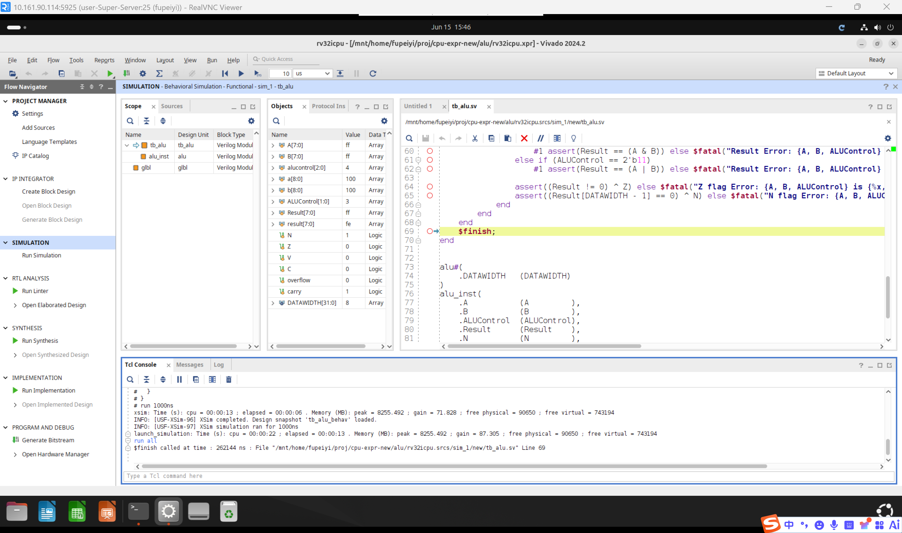
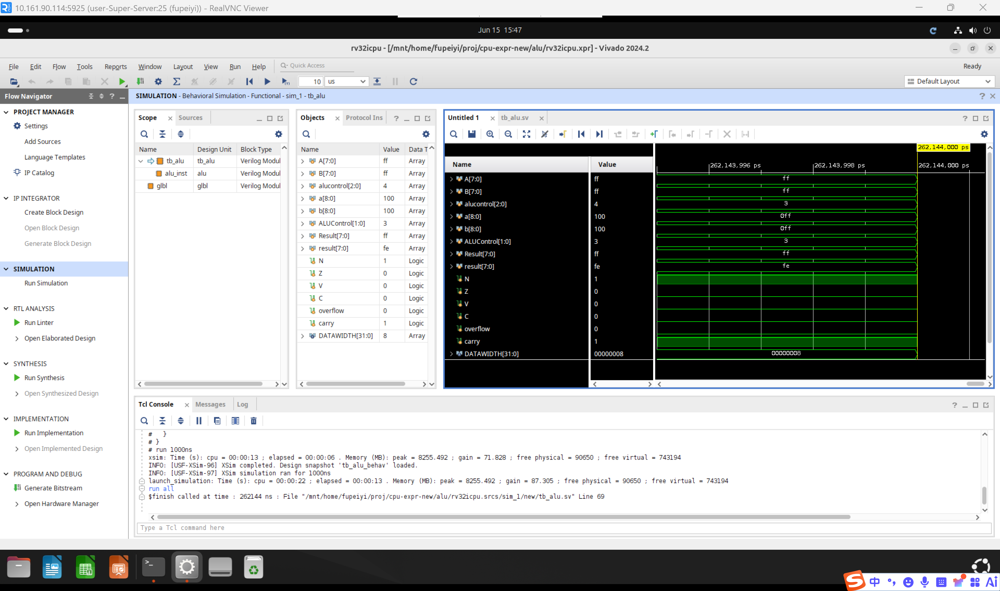

# 一、实验目的

1. 掌握RISC-V处理器中ALU（算术逻辑单元）的基本设计方法
2. 理解ALU各标志位（N、Z、C、V）的计算原理和应用场景
3. 学习使用SystemVerilog硬件描述语言进行数字电路设计
4. 掌握使用Vivado工具进行RTL仿真验证的方法
5. 为后续完整的RISC-V处理器设计奠定基础

# 二、实验环境

- 主机操作系统：Windows 11
- 服务器操作系统：Ubuntu 24.04
- 开发工具：Xilinx Vivado 2024.2
- 设计语言：SystemVerilog
- 仿真工具：Vivado Simulator (XSim)
- 目标器件：xc7k325tffg900-2

# 三、实验内容

本实验要求设计一个满足RISC-V核心子集需求的32位算术逻辑单元（ALU），具体内容包括：

1. **ALU核心模块设计**（`alu.sv`）：实现一个参数化的ALU模块，支持4种运算操作（加法、减法、按位与、按位或），由2位ALUControl信号控制。同时实现N（负标志）、Z（零标志）、C（进位标志）、V（溢出标志）四个状态标志位的计算逻辑。

2. **ALU顶层模块设计**（`top_alu.sv`）：将alu模块例化到顶层模块中，作为上板验证的外部接口。

3. **控制信号编码**：

| ALUControl[1:0] | 功能 |
|:-:|:-:|
| 00 | Add（加法） |
| 01 | Sub（减法） |
| 10 | And（按位与） |
| 11 | Or（按位或） |

4. **标志位定义**：
   - **N (Negative)**：ALU运算结果的最高位，在补码表示下指示结果为负
   - **Z (Zero)**：ALU运算结果为全零时置1
   - **C (Carry)**：无符号运算进位标志。加法时C为最高位进位输出；减法时实现 subtract with carry（A≥B时C=1，否则C=0）
   - **V (Overflow)**：有符号运算溢出标志。加法溢出：两操作数同号而结果异号；减法溢出：两操作数异号而结果与A异号

5. **仿真验证**：使用Vivado Simulator运行`tb_alu.sv`测试平台，通过穷举测试（遍历所有ALUControl编码和8位操作数的所有组合）验证ALU功能的正确性。

# 四、实验过程

## 4.1 ALU核心模块（alu.sv）设计

### 接口定义

模块使用参数化设计，`DATAWIDTH`参数默认为32位：

| 信号名 | 方向 | 位宽 | 说明 |
|:-:|:-:|:-:|:-:|
| A | input | DATAWIDTH | 第一操作数 |
| B | input | DATAWIDTH | 第二操作数 |
| ALUControl | input | 2 | 功能选择码 |
| Result | output | DATAWIDTH | 运算结果 |
| N | output | 1 | 负标志 |
| Z | output | 1 | 零标志 |
| V | output | 1 | 溢出标志 |
| C | output | 1 | 进位标志 |

### 运算逻辑实现

使用`always_comb`组合逻辑块配合`case`语句，根据ALUControl选择对应的运算：

- **Add (00)**：`Result = A + B`。使用扩展位`{1'b0, A} + {1'b0, B}`产生(DATAWIDTH+1)位结果，其中最高位即为进位输出C，低DATAWIDTH位为Result。
- **Sub (01)**：`Result = A - B`。SystemVerilog自动处理补码减法。
- **And (10)**：`Result = A & B`，按位与。
- **Or (11)**：`Result = A | B`，按位或。

### 标志位计算

- **N**：`N = Result[DATAWIDTH-1]`，直接取运算结果的最高位。
- **Z**：`Z = (Result == '0)`，当结果所有位均为0时置1。
- **C（加法）**：从扩展加法结果的第DATAWIDTH位提取进位输出：`{C, Result} = {1'b0, A} + {1'b0, B}`。
- **C（减法）**：subtract with carry 定义，`C = (A >= B)`，按无符号数比较。
- **C（逻辑运算）**：固定为0，进位概念对逻辑运算无意义。
- **V（加法）**：`V = (A[MSB] == B[MSB]) && (Result[MSB] != A[MSB])`，两操作数符号相同而结果符号不同时溢出。
- **V（减法）**：`V = (A[MSB] != B[MSB]) && (Result[MSB] != A[MSB])`，两操作数符号不同而结果与A符号不同时溢出。
- **V（逻辑运算）**：固定为0，溢出概念对逻辑运算无意义。

## 4.2 顶层模块（top_alu.sv）

`top_alu.sv`将`alu`模块按端口对应关系进行例化，默认DATAWIDTH为8位。所有输入输出端口直连到alu实例的对应端口，该模块作为上板时的对外接口。关键例化代码如下：

```systemverilog
alu#(
    .DATAWIDTH   (DATAWIDTH)
)
alu_inst(
    .A           (A         ),
    .B           (B         ),
    .ALUControl  (ALUControl),
    .Result      (Result    ),
    .N           (N         ),
    .Z           (Z         ),
    .V           (V         ),
    .C           (C         )
);
```

在CPU核心子集的实际应用中，ALU的Z标志可复用为beq指令的isTrue信号——当减法运算结果为零（即A=B）时Z=1，等价于isTrue=1。

## 4.3 仿真验证

### 测试平台（tb_alu.sv）分析

测试平台采用穷举测试策略，三组嵌套循环覆盖所有测试向量：
- ALUControl：从00到11，覆盖全部4种运算
- A：从0x00到0xFF（256种取值）
- B：从0x00到0xFF（256种取值）

共计 4 × 256 × 256 = 262,144 组测试向量，使用 SystemVerilog 的 `assert` 语句进行自动检查，全面验证了ALU在各种输入组合下的正确性。

### 验证项

对每种运算，测试平台验证以下内容：

| ALUControl | 验证项 |
|:-:|:-:|
| 00 (Add) | Result = A+B, V标志, C标志 |
| 01 (Sub) | Result = A-B, V标志, C标志 |
| 10 (And) | Result = A&B |
| 11 (Or) | Result = A\|B |
| 全部 | N标志 = Result[MSB], Z标志 = (Result==0) |

### 仿真步骤

1. 在Vivado中打开alu工程，将`tb_alu`设为Top模块（Set as Top）
2. 运行Behavior Simulation
3. 观察Waveform窗口的波形和Tcl Console中的assert输出
4. 确认所有测试通过（无`$fatal`报错信息）
5. 由于测试向量较多（超过26万组），仿真默认运行时间可能不足，需点击Run All确保完整运行

### 仿真结果

所有测试向量均通过，Tcl Console中无`$fatal`报错信息输出，仿真正常结束。表明ALU模块的各项功能（四种运算、四个标志位）均符合设计预期。





# 五、思考题

1.	ALU在RISC-V CPU中与哪些部件相关？它们之间的关系是什么样的？可以结合具体指令的执行过程分析。

- 答：ALU在RISC-V CPU中与寄存器堆、立即数生成器、多路选择器、ALU控制器、数据存储器、写回多路选择器等有相关。寄存器堆用于提供ALU的第一操作数rs1和第二操作数rs2。立即数生成器将指令中的立即数扩展为32位操作数，然后输入ALU。多路选择器用于选择ALU第二操作数来源（寄存器或立即数）。ALU控制器用于根据指令类型生成ALU的ALUControl信号。对于数据存储器，当遇到lw指令和sw指令时需要由ALU计算地址。写回多路选择器用于选择写回寄存器堆的数据来源，该数据可能来自ALU。

2.	ALU的两个操作数来源，尤其是第二个操作数可能来自于寄存器，也可能是立即数，那么要怎么样设计才能区分这两者的输入呢？

- 答：可以增加一个多路选择器来根据指令类型opcode选择数据来源。

3.	我们经常听到ALU控制器这个部件，为什么ALU需要控制器，不能直接使用ALUControl的编码来进行控制吗？

- 答：ALUControl是功能层面的编码（做什么运算），而指令opcode和funct字段是指令层面的编码（是什么指令）。两者之间存在多对一的映射关系。如果直接使用指令编码，会导致编码不统一、信号位宽过大等问题。ALU控制器的存在是为了实现指令集编码到ALU功能编码的转换，这是CPU中控制单元的核心功能之一。显然控制ALU需要的是一个统一的模块来提供信号，ALUControl只是对ALU采取不同操作的一种编码方式。

# 六、实验总结

本实验成功设计并验证了一个功能完整的RISC-V ALU模块，该模块支持加法、减法、按位与、按位或四种运算，并能正确产生N、Z、C、V四个标志位。通过穷举仿真验证，确保了设计的完全正确性。

该ALU模块将作为后续完整RISC-V处理器设计的核心组件，为实现7条指令的子集提供了必要的运算支持。本次实验为理解CPU数据通路和控制器设计打下了坚实基础。