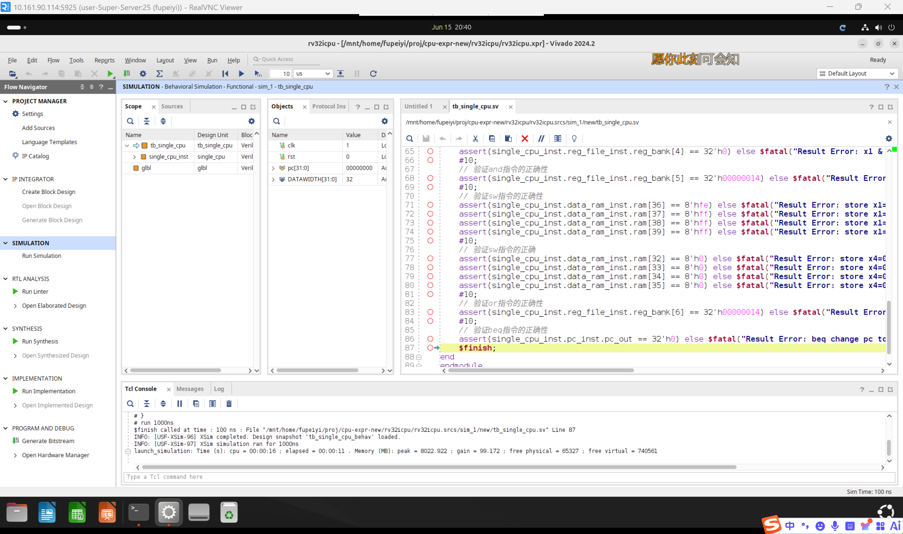
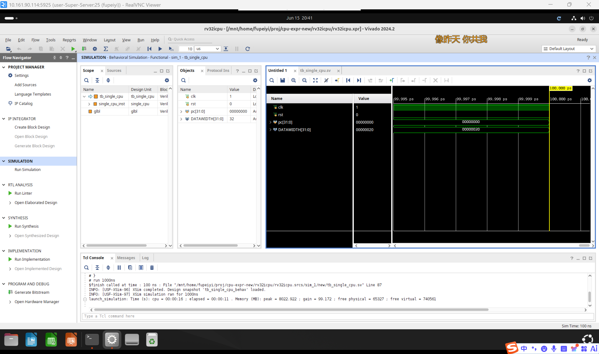

# 一、实验目的

1. 理解 CPU 控制器（Control Unit）的设计原理和分级译码机制
2. 掌握 ALU 控制器（ALU Controller）根据 ALUOP、funct3、funct7 生成 ALUControl 的方法
3. 掌握主控制器根据 opcode 生成各部件控制信号的实现
4. 完成单周期 RISC-V CPU 的顶层集成，理解完整的数据通路与控制通路协同工作
5. 通过仿真验证 7 条核心指令（lw, sw, add, sub, and, or, beq）的正确执行

# 二、实验环境

- 主机操作系统：Windows 11
- 服务器操作系统：Ubuntu 24.04
- 开发工具：Xilinx Vivado 2024.2
- 设计语言：SystemVerilog
- 仿真工具：Vivado Simulator (XSim)
- 目标器件：xc7k325tffg900-2

# 三、实验内容

本实验包含三个核心任务：

1. **ALU 控制器（`ALU_controller.sv`）**：实现分级译码的第二级，根据 ALUOP 和 funct 字段（{funct7[5], funct3}）生成 2 位 ALUControl 信号。

2. **主控制器（`control.sv`）**：实现分级译码的第一级，根据指令 opcode 生成 6 个控制信号：Branch、MemToReg、MemWrite、ALUOP、ALUSrc、RegWrite。

3. **单周期 CPU 顶层集成（`single_cpu.sv`）**：按照架构图将 PC、IM、RF、ImmGen、ALU、ALU_controller、Control、DM 及 3 个 MUX 连接为完整的单周期 CPU。

此外，还需补全 `pc_add2.sv` 和从先前实验复制的已有模块（alu、adder、mux、pc、reg_file、imm_gen、instr_rom、data_ram）。

# 四、实验过程

## 4.1 ALU 控制器（ALU_controller.sv）

### 设计原理

采用分级译码策略：主控制器输出 2 位 ALUOP 信号，ALU 控制器结合 funct3 和 funct7[5] 字段生成最终的 ALUControl。

### 接口定义

| 信号名 | 方向 | 位宽 | 说明 |
|:-:|:-:|:-:|:-:|
| funct | input | 4 | {funct7[5], funct3[2:0]} |
| ALUOP | input | 2 | 主控制器输出的 ALU 操作码 |
| ALUControl | output | 2 | ALU 功能选择码 |

### 译码表

| ALUOP | funct7[5] | funct3 | 指令 | ALUControl |
|:-:|:-:|:-:|:---|:-:|
| 00 | X | XXX | lw/sw | 00 (add) |
| 01 | X | XXX | beq | 01 (sub) |
| 10 | 0 | 000 | add | 00 (add) |
| 10 | 1 | 000 | sub | 01 (sub) |
| 10 | 0 | 111 | and | 10 (and) |
| 10 | 0 | 110 | or | 11 (or) |

### 关键实现

```systemverilog
always_comb begin
    case (ALUOP)
        2'b00: ALUControl = 2'b00;           // lw/sw → add
        2'b01: ALUControl = 2'b01;           // beq → sub
        2'b10:                                // R-type → check funct
            case (funct)
                4'b0000: ALUControl = 2'b00;  // add
                4'b1000: ALUControl = 2'b01;  // sub
                4'b0111: ALUControl = 2'b10;  // and
                4'b0110: ALUControl = 2'b11;  // or
                default: ALUControl = 2'b00;
            endcase
        default: ALUControl = 2'b00;
    endcase
end
```

## 4.2 主控制器（control.sv）

### 接口定义

| 信号名 | 方向 | 位宽 | 说明 |
|:-:|:-:|:-:|:-:|
| opcode | input | 7 | 指令 opcode（instr[6:0]） |
| Branch | output | 1 | 是否为分支指令 |
| MemToReg | output | 1 | 写回数据来源（0:ALU, 1:DM） |
| MemWrite | output | 1 | DM 写使能 |
| ALUOP | output | 2 | ALU 操作码（分级译码第一级） |
| ALUSrc | output | 1 | ALU B 端来源（0:寄存器, 1:立即数） |
| RegWrite | output | 1 | 寄存器写使能 |

### 控制信号真值表

| 指令 | opcode | ALUSrc | MemtoReg | RegWrite | MemWrite | Branch | ALUOP |
|:---|:---|:-:|:-:|:-:|:-:|:-:|:-:|
| R-type | 0110011 | 0 | 0 | 1 | 0 | 0 | 10 |
| lw | 0000011 | 1 | 1 | 1 | 0 | 0 | 00 |
| sw | 0100011 | 1 | 0 | 0 | 1 | 0 | 00 |
| beq | 1100011 | 0 | 0 | 0 | 0 | 1 | 01 |

### PcSrc 信号

Control 只输出 Branch（表示该指令为分支指令），最终跳转控制信号 PcSrc 由 `PcSrc = Branch & Zero` 产生，其中 Zero 来自 ALU 的减法结果标志。

## 4.3 单周期 CPU 顶层集成（single_cpu.sv）

### 架构总览

```
                    ┌──────────┐
        ┌────────── │ Control  │ ← opcode
        │           └──────────┘
        │            │  │  │  │  │  │
        │            ▼  ▼  ▼  ▼  ▼  ▼
        │           RegWrite ALUSrc MemWrite Branch MemToReg ALUOP
        │           │       │      │       │         │        │
  ┌──┐  │  ┌──────┐ │   ┌───┴──┐   │   ┌───┴──────┐  │  ┌─────┴────────┐
  │PC├──┼──► IM   │ │   │ MUX  │   │   │MUX(Branch│  │  │ALU_controller│
  └──┘  │  └──┬───┘ │   └──┬───┘   │   │  &Zero)  ├──┘  └─────┬────────┘
   ▲    │     │     │      │       │   └────┬─────┘           │
   │    │  ┌──▼─────┴─┐    │   ┌───▼──┐     │              ┌──▼──┐
   │    │  │ RegFile  │    │   │ ALU  │     │              │ ALU │
   │    │  │ (2R/1W)  │    │   └──┬───┘     │              │Contr│
   │    │  └────┬─────┘    │      │         │              └──┬──┘
   │    │       │          │      │         │                 │
   │    │  ┌────▼──┐    ┌──▼───┐  │    ┌────▼──┐              │
   │    │  │ImmGen │    │ MUX  │  │    │pc_add2│              │
   │    │  └───┬───┘    │ALUSrc│  │    └───┬───┘              │
   │    │      │        └──┬───┘  │        │                  │
   │    │      │           │      │        │                  │
   │    │      │        ┌──▼──────▼──┐  ┌──▼─────┐            │
   │    │      │        │    ALU     │  │ NPC    │            │
   │    │      │        └─────┬──────┘  │  MUX   ├────────────┘
   │    │      │              │         └───┬────┘
   │    │      │         ┌────▼────┐        │
   │    │      │         │   DM    │        │
   │    │      │         └────┬────┘        │
   │    │      │              │             │
   │    │   ┌──▼──────────────▼──┐          │
   │    │   │  WriteBack MUX     │          │
   │    └───┤  (MemToReg)        │          │
   │        └────────┬───────────┘          │
   └─────────────────┴──────────────────────┘
                 (NPC loop)
```

### 关键连线

| 数据路径 | 连接 |
|:---|:---|
| 取指 | PC.pc_out → IM.daddr → IM.dout = instr |
| 译码 | instr[6:0] → Control.opcode |
| 寄存器地址 | instr[19:15]→rs1_addr, instr[24:20]→rs2_addr, instr[11:7]→rd_addr |
| ALU控制 | {instr[30], instr[14:12]} → ALU_controller.funct |
| ALU A端 | RegFile.rs1_rdata → ALU.A |
| ALU B端 | ALUSrc MUX: rs2_rdata 或 imm → ALU.B |
| 访存地址 | ALU.Result → DM.daddr |
| 写回数据 | MemToReg MUX: ALU.Result 或 DM.dout → RegFile.wr_wdata |
| NPC | PcSrc MUX: pc+4 或 pc+imm → PC.npc |
| PcSrc | Branch & Zero |

### 模块例化清单

| 模块 | 实例名 | 数量 |
|:---|:---|:---|
| pc_add1 | adder_left (PC+4) | 1 |
| pc_add2 | adder_right (PC+imm) | 1 |
| mux | mux_npc (NPC选择) | 1 |
| mux | mux_alusrc (ALU B端选择) | 1 |
| mux | mux_dout (写回数据选择) | 1 |
| pc | pc_inst | 1 |
| instr_rom | instr_rom_inst | 1 |
| reg_file | reg_file_inst | 1 |
| imm_gen | imm_gen_inst | 1 |
| control | control_inst | 1 |
| ALU_controller | ALU_controller_inst | 1 |
| alu | alu_inst | 1 |
| data_ram | data_ram_inst | 1 |

## 4.4 pc_add2 模块

`pc_add2` 与 `pc_add1` 结构相同，封装 adder 模块用于计算 PC + 立即数（分支目标地址）。

## 4.5 仿真验证

### 测试程序

测试平台加载 `rom_data.txt` 和 `ram_data.txt`，执行以下指令序列：

| # | 指令 | 功能 | 验证点 |
|:-:|:---|:---|:---|
| 1 | lw x1, 0x20(x0) | x1 = MEM[32] = -1 | x1=0xffffffff |
| 2 | lw x2, 0x24(x0) | x2 = MEM[36] = 1 | x2=0x00000001 |
| 3 | lw x3, 0x28(x0) | x3 = MEM[40] = 21 | x3=0x00000015 |
| 4 | sub x1, x1, x2 | x1 = -1 - 1 = -2 | x1=0xfffffffe |
| 5 | and x4, x1, x2 | x4 = -2 & 1 = 0 | x4=0 |
| 6 | and x5, x1, x3 | x5 = -2 & 21 = 0x14 | x5=0x00000014 |
| 7 | sw x1, 0x04(x0) | MEM[36:39] = x1 | MEM[36:39]=fe,ff,ff,ff |
| 8 | sw x4, 0x08(x0) | MEM[40:43] = x4 | MEM[40:43]=00,00,00,00 |
| 9 | or x6, x4, x5 | x6 = 0 \| 0x14 = 0x14 | x6=0x00000014 |
| 10 | beq x5, x6, offset | x5==x6 → 跳转至地址 0 | pc=0 |

### 仿真结果

所有断言通过，Tcl Console 输出 `$finish`，表明：
- 三条 lw 指令正确从 DM 加载数据到寄存器
- sub 指令正确执行补码减法
- and/or 指令正确执行按位逻辑运算
- sw 指令正确将寄存器值存入 DM
- beq 指令在条件满足时正确执行跳转，PC 回到地址 0
- 控制信号在各种指令类型下的生成均正确
- 数据通路各 MUX 的选择逻辑正确





# 五、实验总结

本实验完成了 RISC-V 单周期 CPU 的完整设计，包括：

- **ALU 控制器**：实现分级译码第二级，正确生成 4 种 ALUControl 编码
- **主控制器**：实现分级译码第一级，根据 opcode 生成 6 种控制信号
- **单周期 CPU 集成**：将 13 个模块、3 个 MUX 按照架构图连接为完整的 7 指令 CPU

通过穷举指令序列的仿真验证，确认了 CPU 能够正确执行 lw、sw、add、sub、and、or、beq 全部 7 条核心指令，标志着从底层器件到完整处理器的设计流程全部贯通。

本次实验是整个课程的核心节点——将之前实验实现的 ALU、PC、RegFile、ImmGen、IM、DM 等部件与控制逻辑结合，形成了一条可运行 RISC-V 指令的单周期处理器。
