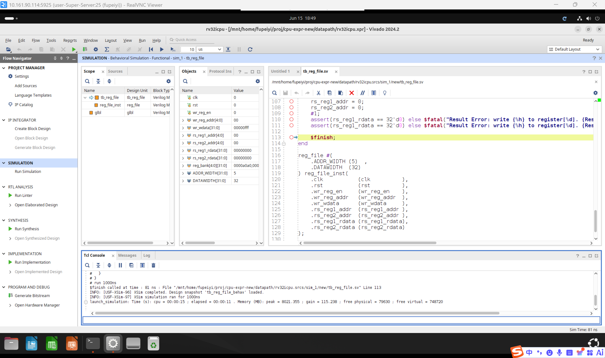
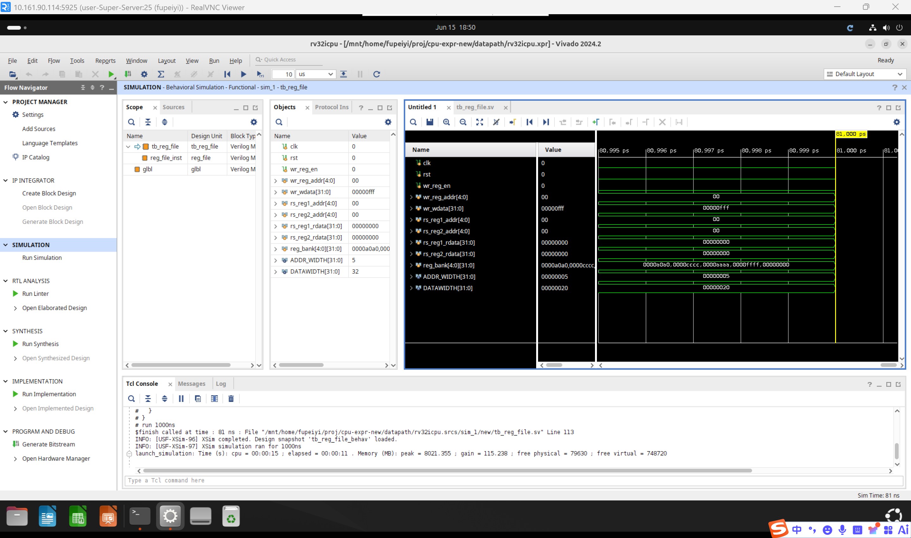
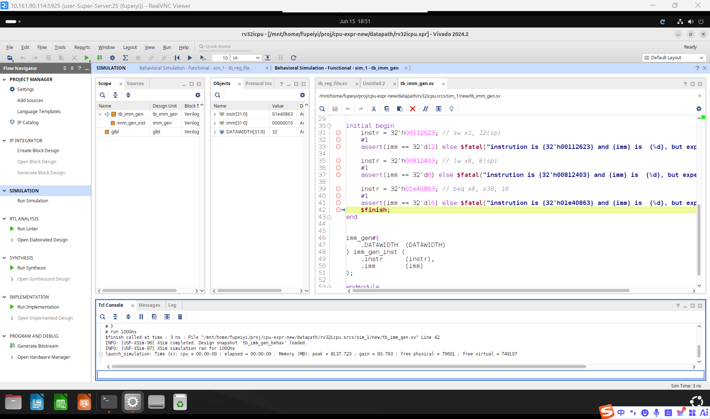
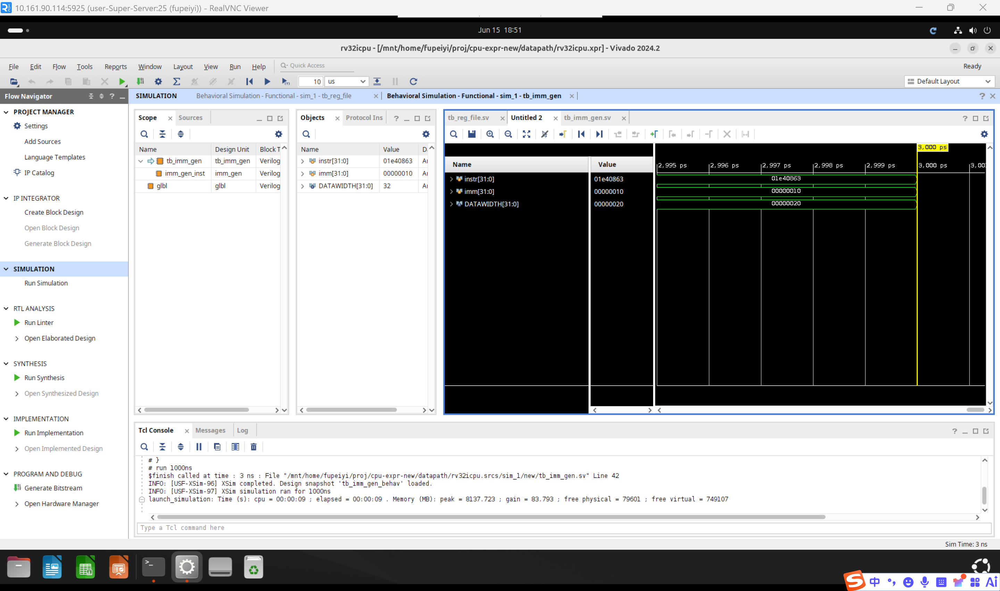
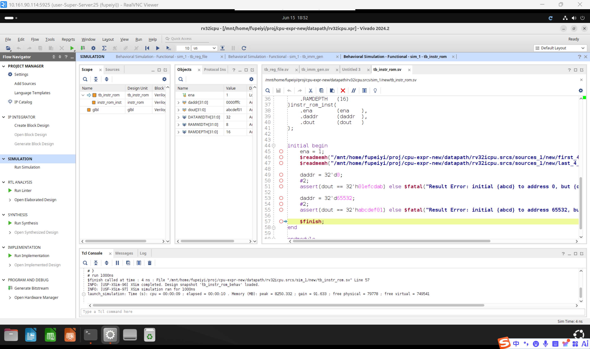
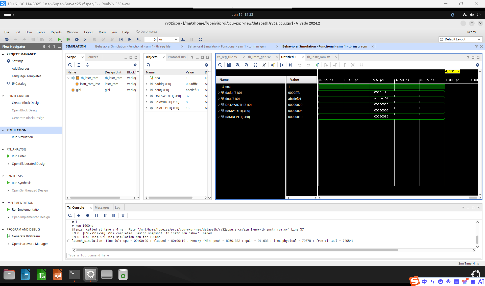
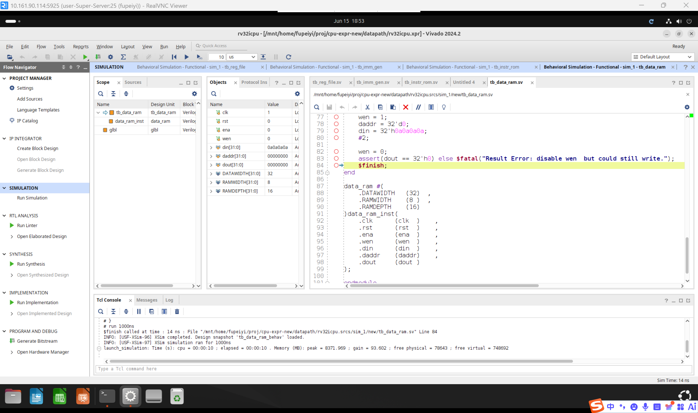
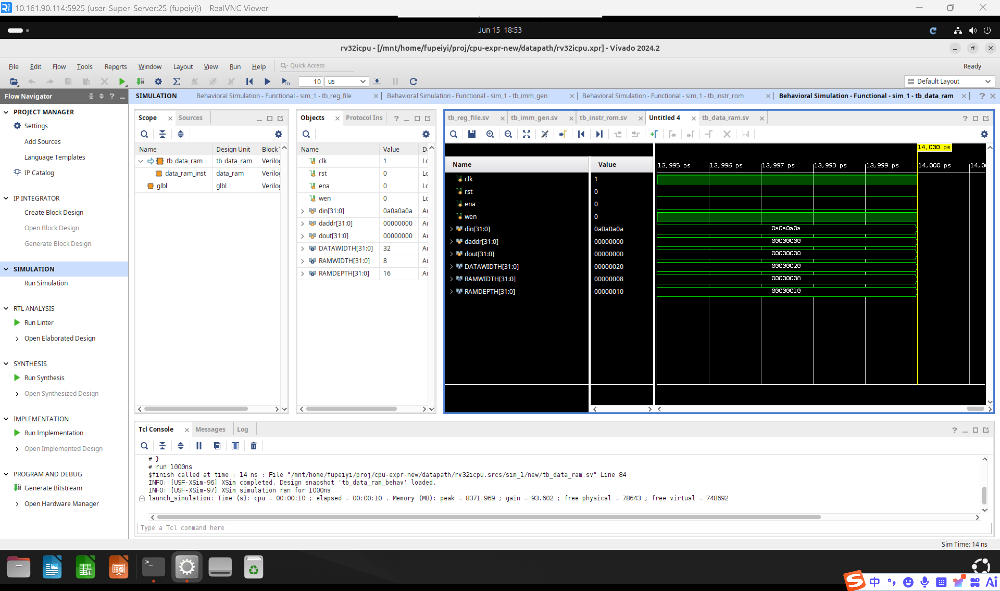

# 一、实验目的

1. 掌握RISC-V单周期CPU数据通路的设计方法和分析流程
2. 理解程序计数器（PC）、寄存器堆（RF）、立即数生成器（IMMGEN）、存储器（IM/DM）等核心部件的功能与实现
3. 掌握异步复位与同步复位的区别，以及时序逻辑与组合逻辑的适用场景
4. 学习通过分析指令执行过程来确定数据通路中所需部件及其连接关系
5. 为后续完整的单周期CPU集成设计奠定基础

# 二、实验环境

- 主机操作系统：Windows 11
- 服务器操作系统：Ubuntu 24.04
- 开发工具：Xilinx Vivado 2024.2
- 设计语言：SystemVerilog
- 仿真工具：Vivado Simulator (XSim)
- 目标器件：xc7k325tffg900-2

# 三、实验内容

本实验要求完成RISC-V单周期CPU数据通路中各部件的设计与实现，共计7个核心模块：

1. **程序计数器（`pc.sv`）**：时序逻辑模块，含异步复位，在每个时钟上升沿将下一指令地址（NPC）加载到当前PC值。

2. **加法器（`adder.sv`）**：纯组合逻辑，两个操作数相加输出结果，用于PC+4和跳转地址计算。

3. **二选一多路选择器（`mux.sv`）**：纯组合逻辑，根据Control信号选择A或B输出，用于NPC的跳转/顺序选择。

4. **寄存器堆（`reg_file.sv`）**：含32个32位寄存器（x0硬连线为0），两个组合逻辑读端口，一个时序逻辑写端口（含异步复位）。x0寄存器始终为0。

5. **立即数生成器（`imm_gen.sv`）**：纯组合逻辑，根据指令opcode识别I-type/S-type/B-type格式，提取并符号扩展立即数字段。

6. **指令存储器（`instr_rom.sv`）**：模拟只读指令存储器，组合逻辑读，按字节地址小端序拼接32位指令字。

7. **数据存储器（`data_ram.sv`）**：模拟随机存取数据存储器，组合逻辑读，时序逻辑写（含异步复位），支持字节级读写。

此外，`alu.sv`（算术逻辑单元）同样需要实现（与实验一相同），以支持完整的数据通路测试。

# 四、实验过程

## 4.1 程序计数器（pc.sv）

### 接口定义

| 信号名 | 方向 | 位宽 | 说明 |
|:-:|:-:|:-:|:-:|
| clk | input | 1 | 系统时钟 |
| rst | input | 1 | 异步复位信号（高有效） |
| npc | input | DATAWIDTH | 下一指令地址（来自NPC模块） |
| pc_out | output | DATAWIDTH | 当前程序计数器值 |

### 实现要点

- 使用 `always_ff @(posedge clk, posedge rst)` 实现异步复位：当`rst`为高时，`pc_out`立即清零；否则在时钟上升沿将`npc`加载到`pc_out`。
- CPU上电时pc复位为0，从地址0开始取指执行。

```systemverilog
always_ff @(posedge clk, posedge rst) begin
    if (rst)
        pc_out <= '0;
    else
        pc_out <= npc;
end
```

## 4.2 加法器（adder.sv）

### 接口定义

| 信号名 | 方向 | 位宽 | 说明 |
|:-:|:-:|:-:|:-:|
| A | input | DATAWIDTH | 被加数 |
| B | input | DATAWIDTH | 加数 |
| Result | output | DATAWIDTH | 和（不考虑溢出） |

### 实现要点

- 纯组合逻辑：`assign Result = A + B;`
- 用于两处：NPC模块中计算`PC+4`，以及beq跳转地址计算`PC+imm`。

## 4.3 多路选择器（mux.sv）

### 接口定义

| 信号名 | 方向 | 位宽 | 说明 |
|:-:|:-:|:-:|:-:|
| A | input | WIDTH | 第一输入 |
| B | input | WIDTH | 第二输入 |
| Control | input | 1 | 选择信号（0选A，1选B） |
| Result | output | WIDTH | 输出 |

### 实现要点

- 纯组合逻辑：`assign Result = Control ? B : A;`
- 在NPC模块中，Control对应PcSrc信号，选择`PC+4`（顺序执行）或`PC+imm`（跳转）。

## 4.4 寄存器堆（reg_file.sv）

### 接口定义

| 信号名 | 方向 | 位宽 | 说明 |
|:-:|:-:|:-:|:-:|
| clk | input | 1 | 系统时钟 |
| rst | input | 1 | 异步复位（高有效） |
| wr_reg_en | input | 1 | 写使能（1写0读） |
| wr_reg_addr | input | 5 | 写目的寄存器地址 |
| wr_wdata | input | 32 | 写入数据 |
| rs_reg1_addr | input | 5 | 读寄存器地址1 |
| rs_reg2_addr | input | 5 | 读寄存器地址2 |
| rs_reg1_rdata | output | 32 | 读数据1 |
| rs_reg2_rdata | output | 32 | 读数据2 |

### 实现要点

- **x0硬连线为0**：无论读写，x0（地址0）始终为0。写操作时跳过x0，读操作时直接输出0。
- **写操作为时序逻辑**：`always_ff @(posedge clk, posedge rst)`。rst时全部寄存器清零；`wr_reg_en=1`时将`wr_wdata`写入目标寄存器。
- **读操作为组合逻辑**：`assign`直接读取，无需等待时钟边沿。这保证了同一周期内写后能读到新值。

```systemverilog
// 异步复位 + 时序写
always_ff @(posedge clk, posedge rst) begin
    if (rst) begin
        for (int i = 0; i < 32; i++)
            reg_bank[i] <= '0;
    end else if (wr_reg_en) begin
        if (wr_reg_addr != 5'd0)
            reg_bank[wr_reg_addr] <= wr_wdata;
    end
end

// 组合逻辑读（x0始终为0）
assign rs_reg1_rdata = (rs_reg1_addr == 5'd0) ? '0 : reg_bank[rs_reg1_addr];
assign rs_reg2_rdata = (rs_reg2_addr == 5'd0) ? '0 : reg_bank[rs_reg2_addr];
```

## 4.5 立即数生成器（imm_gen.sv）

### 接口定义

| 信号名 | 方向 | 位宽 | 说明 |
|:-:|:-:|:-:|:-:|
| instr | input | 32 | 32位指令字 |
| imm | output | 32 | 符号扩展后的立即数 |

### 实现要点

根据指令opcode（`instr[6:0]`）识别格式并提取立即数：

| 指令 | 格式 | 立即数位分布 | 符号扩展 |
|:---|:---|:---|:---:|
| lw | I-type | `instr[31:20]`（12位） | `{20{instr[31]}, instr[31:20]}` |
| sw | S-type | `{instr[31:25], instr[11:7]}`（12位） | `{20{instr[31]}, instr[31:25], instr[11:7]}` |
| beq | B-type | `{instr[31], instr[7], instr[30:25], instr[11:8], 1'b0}`（13位） | `{19{instr[31]}, ...}` |

```systemverilog
always_comb begin
    unique case (instr[6:0])
        7'b0000011:  // I-type: lw
            imm = { {20{instr[31]}}, instr[31:20] };
        7'b0100011:  // S-type: sw
            imm = { {20{instr[31]}}, instr[31:25], instr[11:7] };
        7'b1100011:  // B-type: beq
            imm = { {19{instr[31]}}, instr[31], instr[7], instr[30:25], instr[11:8], 1'b0 };
        default:
            imm = '0;
    endcase
end
```

### 验证示例

| 指令编码 | 指令 | 预期imm |
|:---|:---|:---|
| `0x00112623` | `sw x1, 12(sp)` | 12 |
| `0x00812403` | `lw x8, 8(sp)` | 8 |
| `0x01e40863` | `beq x8, x30, 16` | 16 |

## 4.6 指令存储器（instr_rom.sv）

### 接口定义

| 信号名 | 方向 | 位宽 | 说明 |
|:-:|:-:|:-:|:-:|
| ena | input | 1 | 使能信号（1有效） |
| daddr | input | 32 | 读地址（字节地址） |
| dout | output | 32 | 读出指令字 |

### 实现要点

- 内部`rom`数组为字节宽度（8位），深度为 `2**RAMDEPTH`。
- 组合逻辑读：`ena=1`时，按小端序拼接4个连续字节为32位指令字；`ena=0`时输出0。
- 适用于模拟ROM行为，通过`$readmemh`在仿真中加载指令。

```systemverilog
always_comb begin
    if (ena)
        dout = {rom[daddr+3], rom[daddr+2], rom[daddr+1], rom[daddr]};
    else
        dout = '0;
end
```

## 4.7 数据存储器（data_ram.sv）

### 接口定义

| 信号名 | 方向 | 位宽 | 说明 |
|:-:|:-:|:-:|:-:|
| clk | input | 1 | 系统时钟 |
| rst | input | 1 | 异步复位（高有效） |
| ena | input | 1 | 使能信号（1有效） |
| wen | input | 1 | 写使能（1有效） |
| din | input | 32 | 写入数据 |
| daddr | input | 32 | 读写地址（字节地址） |
| dout | output | 32 | 读出数据 |

### 实现要点

- **读为组合逻辑**：`ena=1`时立即从`daddr`处读出32位字（小端序拼接），`ena=0`时输出0。
- **写为时序逻辑**：`ena=1`且`wen=1`时，在时钟上升沿将`din`按字节拆分写入RAM；rst时全清零。
- `ena=0`时写操作被屏蔽，保护存储器内容。

```systemverilog
// 时序写
always_ff @(posedge clk, posedge rst) begin
    if (rst) begin
        for (int i = 0; i < 2**RAMDEPTH; i++)
            ram[i] <= '0;
    end else if (ena && wen) begin
        ram[daddr]   <= din[7:0];
        ram[daddr+1] <= din[15:8];
        ram[daddr+2] <= din[23:16];
        ram[daddr+3] <= din[31:24];
    end
end

// 组合逻辑读
always_comb begin
    if (ena)
        dout = {ram[daddr+3], ram[daddr+2], ram[daddr+1], ram[daddr]};
    else
        dout = '0;
end
```

## 4.8 仿真验证

### 各模块独立测试

依照实验指导书要求，对RF、IMMGEN、IM、DM四个模块分别运行对应的仿真测试：

| 模块 | 测试平台 | 测试项 |
|:---|:---|:---|
| reg_file | tb_reg_file.sv | 初始值读取、异步复位清零、x31写入读出、x0写保护 |
| imm_gen | tb_imm_gen.sv | S-type(sw)立即数提取、I-type(lw)立即数提取、B-type(beq)立即数提取 |
| instr_rom | tb_instr_rom.sv | 地址0读取、高地址(65532)读取 |
| data_ram | tb_data_ram.sv | 初始值读取、写后读、异步复位清零、ena=0写保护 |

### 仿真步骤

1. 在Vivado中打开datapath工程
2. 将对应的`tb_xxx`模块设为Top（Set as Top）
3. 运行Behavior Simulation
4. 观察Tcl Console确认所有`assert`通过
5. 如有测试失败，根据`$fatal`错误信息定位问题

### 仿真结果

各模块独立仿真均通过，`$fatal`无报错，表明：
- 寄存器堆的读写功能、x0硬连线保护、异步复位均正确





- 立即数生成器对I-type、S-type、B-type三种指令格式的立即数提取和符号扩展正确





- 指令存储器和数据存储器的字节寻址、小端序32位字组装正确





- 数据存储器的时序写、使能控制和异步复位正确





## 4.9 数据通路整体分析

### 七条指令的数据流转

以本实验实现的部件为基础，七条核心指令的数据流转如下：

**算术类指令（add/sub/and/or）**：
```
IM → RF(rs1, rs2) → ALU → RF(rd写回)
PC → PC+4 → NPC → PC
```

**跳转指令（beq）**：
```
IM → RF(rs1, rs2) → ALU(减法) → Zero标志 → PcSrc → MUX → NPC → PC
IM → IMMGEN(符号扩展) → Adder(PC+imm) → MUX(B端)
```

**存储指令（sw）**：
```
IM → RF(rs1→ALU.A, rs2→DM.din) → IMMGEN → ALU(加法) → DM(地址) → 写入
```

**加载指令（lw）**：
```
IM → RF(rs1→ALU.A) → IMMGEN → ALU(加法) → DM(地址) → DM(读出) → RF(rd写回)
```

# 五、思考题

**1. 我们给出的数据通路中还缺少什么器件？**

- 答：当前数据通路中还缺少**控制器（Controller/Control Unit）**和**ALU控制器（ALU Controller）**。控制器负责根据指令的opcode和funct字段生成所有部件的控制信号，包括：RF写使能（RegWrite）、ALU操作选择（ALUControl）、多路选择器控制（PcSrc、ALUSrc）、DM写使能（MemWrite）、写回数据选择（MemtoReg）等。此外，图中缺少**分支控制逻辑**——需要将ALU的Zero标志与Branch信号组合（`PcSrc = Branch & Zero`）来产生NPC的MUX控制信号。

**2. 如何设计一个完整的控制器？**

- 答：控制器的设计分为主控制器和ALU控制器两级。**主控制器**根据指令opcode（`instr[6:0]`）生成一级控制信号：RegWrite、ALUSrc、MemWrite、MemtoReg、Branch等。**ALU控制器**根据`ALUOp`（来自主控制器）和`funct3`/`funct7`字段生成具体的`ALUControl`编码。设计流程为：(1) 列出所有指令所需控制信号的取值表；(2) 写出每个控制信号的逻辑表达式（积之和形式）；(3) 用组合逻辑（`always_comb` + `case`）实现。对于7条指令的核心子集，控制器可采用简单的case语句直接译码。

# 六、实验总结

本实验完成了RISC-V单周期CPU数据通路中全部核心部件的设计与实现，包括程序计数器（PC）、加法器、多路选择器、寄存器堆（RF）、立即数生成器（IMMGEN）、指令存储器（IM）和数据存储器（DM），共计8个模块（含ALU）。

通过各模块的独立仿真验证，所有部件的功能均正确：
- **PC模块**实现了异步复位和时钟上升沿触发的地址更新
- **寄存器堆**实现了双端口组合逻辑读和单端口时序逻辑写，x0硬连线为0
- **立即数生成器**正确识别I-type、S-type、B-type三种指令格式并进行符号位扩展
- **指令存储器和数据存储器**实现了字节寻址、小端序32位字组装和异步复位

本实验深入理解了数据通路的设计方法论——通过分析每条指令的数据流转来确定所需部件和连接关系。这为后续实验中控制器的设计和完整单周期CPU的集成提供了关键基础。
