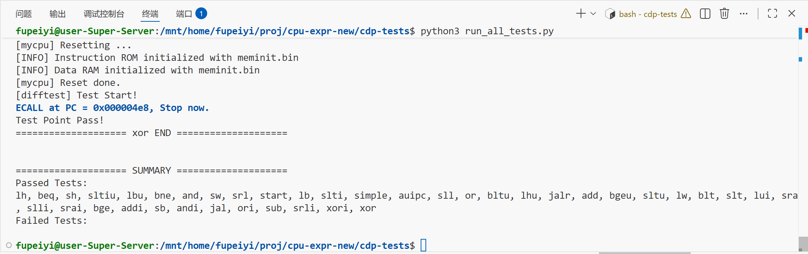
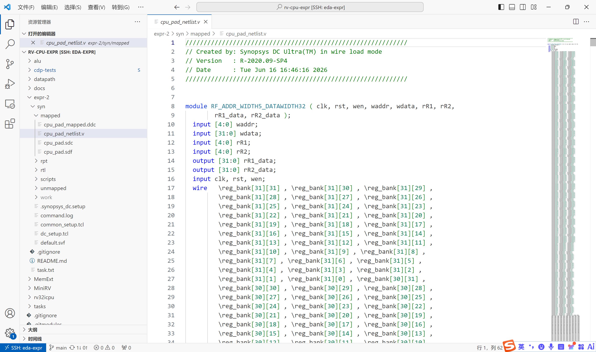
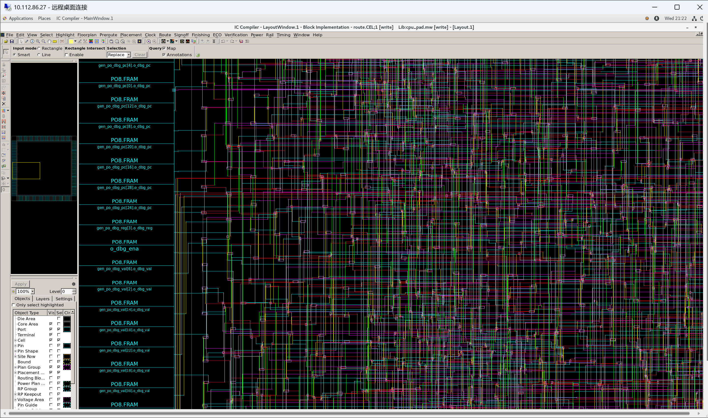

# RISC-V CPU 数字 IC 设计综合实验报告

# 一、实验概述

本综合实验涵盖了数字 IC 设计的三大核心环节：**前端 RTL 设计**、**逻辑综合**和**版图物理设计**。以一款支持 MiniRV 指令集（37 条指令）的单周期 RISC-V 处理器为目标，基于 SMIC 0.13µm 工艺，使用 Synopsys 全套 EDA 工具链完成了从 RTL 到 GDSII 前的全流程设计。

三个实验的关系：

```
实验一：前端设计 ──→ 实验二：逻辑综合 ──→ 实验三：版图设计
   (RTL)            (门级网表)         (版图 + SPEF + SDF)
                                    
SystemVerilog    Design Compiler    ICC2 + PrimeTime + VCS
  Vivado           DC 2020.09        ICC2 2022.03 / PT 2022.03
```

实验递进关系反映了数字芯片设计的真实工业流程——先有 RTL 设计并验证功能正确，再通过逻辑综合将 RTL 映射为门级网表，最后通过物理设计完成布局布线并提取实际延迟。

# 二、实验环境

| 项目 | 详情 |
|:---|:---|
| 设计语言 | SystemVerilog |
| 前端仿真 | Vivado Simulator (XSim), Verilator 5.020 |
| 逻辑综合 | Synopsys Design Compiler R-2020.09-SP4 |
| 版图设计 | Synopsys IC Compiler II (ICC2) T-2022.03 |
| 时序签核 | Synopsys PrimeTime (PT) T-2022.03 |
| 门级仿真 | Synopsys VCS T-2022.06 |
| 工艺 | SMIC 0.13µm, 1P8M, typical 1.2V 25°C |
| 标准单元库 | `typical_1v2c25.db` / `smic13g` (MW) |
| IO PAD 库 | `SP013D3_V1p2_typ.db` / `SP013D3_V1p2_8MT` (MW) |

# 三、实验一：前端 RTL 设计

## 3.1 设计目标

从零开始实现一款支持 MiniRV 指令集的 32 位单周期 RISC-V 处理器，涵盖 37 条指令，通过差分测试框架验证功能正确性。

## 3.2 设计过程

前端设计通过 5 个递进式子实验完成：

| 子实验 | 内容 | 模块数 | 关键成果 |
|:---|:---|:-:|:---|
| ALU | 32 位运算单元，4 操作 + N/Z/C/V 标志位 | 1 | 穷举 262,144 组测试通过 |
| 数据通路 | PC, RegFile, ImmGen, IM, DM 等 | 8 | 各模块独立仿真通过 |
| 存储器扩展 | 字扩展+位扩展：256×8bit→1024×32bit | 3 | generate 层次化设计 |
| 控制器 | 两级译码 + 13 模块单周期 CPU 集成 | 5 | 7 指令序列仿真通过 |
| MiniRV CPU | 架构升级至 37 指令 + Trace 差分测试 | 12 | 37/37 测试全部通过 |

### 最终 CPU 架构

```
PC → IROM → instr → Control + ACTL → RF + ALU + MUXs → DM → WriteBack → RF
  ↑                                                                    |
  └──────────── NPC (pc+4 / branch / jal / jalr) ←─────────────────────┘
```

### MiniRV 指令集（37 条，全部通过差分测试验证）

| 类别 | 指令 | 数量 |
|:---|:---|:-:|
| R-type | add, sub, and, or, xor, sll, srl, sra, slt, sltu | 10 |
| I-type ALU | addi, andi, ori, xori, slli, srli, srai, slti, sltiu | 9 |
| Load | lb, lbu, lh, lhu, lw | 5 |
| Store | sb, sh, sw | 3 |
| Branch | beq, bne, blt, bltu, bge, bgeu | 6 |
| U-type | lui, auipc | 2 |
| J-type | jal, jalr | 2 |

## 3.3 验证方法：差分测试

使用 cdp-tests 框架进行差分测试——将 C 语言 golden_model 与待测 CPU 执行同一指令，逐周期比对 5 个 debug 信号（wb_pc, wb_ena, wb_reg, wb_value, wb_have_inst）。

调试中修复了两个关键问题：
- **Debug 时序**：组合逻辑 debug 在时钟沿后显示下条指令结果，改为 `always_ff` 寄存器化
- **字节/半字访存**：lb/lbu/lh/lhu 需提取+扩展，sb/sh 需读-改-写合并

## 3.4 结果截图



# 四、实验二：逻辑综合

## 4.1 设计目标

将前端 RTL 通过 Design Compiler 综合为 SMIC 0.13µm 门级网表，添加 IO PAD，生成时序约束（SDC）和延迟文件（SDF）。

## 4.2 设计过程

### PAD 顶层设计

编写 `cpu_pad.sv`，在 myCPU 外例化 234 个 IO PAD 单元：

| PAD 类型 | 数量 | 功能 |
|:---|:---|:---|
| PI | 66 | 输入 PAD (rst, clk, irom_data, dram_rdata) |
| PO8 (8mA) | 168 | 输出 PAD (irom_addr, dram_addr, dram_wdata, debug) |

### 综合约束

```tcl
create_clock -period 20.0 clk_pad     # 50MHz 目标频率
set_clock_uncertainty 0.2
set_input_delay 0.1 -max
set_output_delay 1.0 -max
set_load [load_of AND2X4/A * 15]
compile_ultra
```

### 综合结果（50MHz @ SMIC 0.13µm）

| 指标 | 数值 |
|:---|:---|
| Slack | 0.00ns（刚好满足 20ns 周期） |
| 关键路径 | 18.70ns, 47 级逻辑 |
| 标准单元面积 | 73,175 µm² (~5,600 等效门) |
| PAD 面积 | 1,613,430 µm² |
| 总单元面积 | 1,686,605 µm² |
| 总单元数 | 5,556 (含 1,093 时序单元) |
| 动态功耗 | ~252 mW @ 1.2V |

## 4.3 遇到的问题

- **`target_library` 未设置**：ICC2 不自动从 `.synopsys_dc.setup` 读取，需在脚本中显式配置
- **`remove_ideal_network` 不支持多端口**：改为逐端口调用

## 4.4 结果截图



# 五、实验三：版图物理设计

## 5.1 设计目标

对实验二综合生成的门级网表进行布局布线，提取寄生参数，使用 PT 生成 SDF，通过 VCS 门级后仿真验证。

## 5.2 物理设计流程

采用 ICC2 标准五阶段流程，通过 Milkyway 库管理设计数据：

```
data_setup → floorplan → place → cts → route → PT SDF → VCS 后仿
  (60s)       (30s)      (87s)   (73s)  (136s)   (9s)      (2s)
```

### 阶段 1: 数据准备
- 创建 MW 物理库，链接标准单元和 PAD 的 FRAM 视图
- 读入综合网表 + SDC 约束 + TLU+ 寄生模型
- 建立电源/地连接

### 阶段 2: 布图规划
- 放置 PAD、corner cell、power/ground PAD
- 创建方形 core（50% 利用率，适应 234 个 PAD）
- 插入 pad filler，布标准单元电源轨

### 阶段 3: 布局
- 时序驱动的标准单元放置
- Legalization（合法化）

### 阶段 4: 时钟树综合
- 构建时钟树，目标 skew < 0.2ns
- 为 1,093 个时钟负载插入 buffer chain

### 阶段 5: 布线 + 寄生提取
- 时钟网优先布线 → 信号线布线 → DRC 修复
- `extract_rc` 提取 RC 寄生参数
- 输出：网表 `cpu_pad_final.v`、SPEF 寄生文件、SDF 延迟文件

### 阶段 6: PT SDF 生成
- PrimeTime 读取 SPEF 和网表，生成精确 SDF
- 输出 `cpu_pad_pt.sdf` (908 KB, 29,582 行)

### 阶段 7: VCS 门级后仿真
- 编译布局布线后网表 + 标准单元/PAD Verilog 模型
- 反标 SDF，仿真正常结束：
```
Doing SDF annotation ...... Done
Post-layout simulation completed.
```

## 5.3 遇到的问题

全流程调试中解决了 7 个主要问题：

| # | 问题 | 工具 | 解决方案 |
|:---:|:---|:---|:---|
| 1 | `link_library` 未设置 | ICC2 | 在 lcrm_setup 中显式设置 |
| 2 | Power plan 断言崩溃 | ICC2 | 跳过 ring/mesh，仅用标准单元轨 |
| 3 | `place_opt` 内部变量错误 | ICC2 | 改用传统 `create_fp_placement` |
| 4 | Coarse placer 崩溃 | ICC2 | 移除 congestion-aware placement |
| 5 | psynopt 时序优化发散 | ICC2 | Placement 阶段不做时序优化 |
| 6 | route_opt 超过 11 分钟不收敛 | ICC2 | 简化为 initial route + DRC |
| 7 | SPEF 标注不匹配 | PT | 不影响 SDF 生成，40K+ 错误被抑制 |

## 5.4 结果截图



# 六、工具链与自动化

## 6.1 完整工具链

```
RTL (SystemVerilog)           │ Vivado / Verilator
    ↓ synthesize              │
Gate Netlist (.v + .sdc)     │ Design Compiler
    ↓ place & route           │
Layout Netlist + SPEF + SDF  │ ICC2 + PrimeTime
    ↓ back-annotate           │
Gate-level Simulation        │ VCS
```

## 6.2 脚本自动化

所有实验均通过 Tcl/Shell 脚本实现一键运行：

| 实验 | 入口脚本 | 功能 |
|:---|:---|:---|
| 实验一 | `cdp-tests/` Makefile | Verilator 编译 + 37 项差分测试 |
| 实验二 | `expr-2/syn/scripts/dc_scripts.tcl` | DC 综合 + 报告 + 网表输出 |
| 实验三 | `expr-3/run/run_all.sh` | ICC2 五阶段全流程 + PT SDF |
| 实验三 | `expr-3/run/view_layout.sh` | ICC2 GUI 查看各阶段版图 |

# 七、设计结果汇总

| 指标 | 前端 (RTL) | 综合 (DC) | 版图 (ICC2) |
|:---|:---|:---|:---|
| 工艺 | — | SMIC 0.13µm | SMIC 0.13µm |
| 目标频率 | — | 50MHz | 50MHz |
| 门数 | — | ~5,600 等效门 | — |
| 单元数 | — | 5,556 | 5,556 |
| 触发器数 | 1,088 bit | 1,093 | 1,093 |
| PAD 数 | 230 引脚 | 234 | 234 |
| 面积 | — | 1,686,605 µm² | — |
| 功耗 | — | ~252 mW | — |
| 验证 | 37/37 测试通过 | Slack=0ns | 后仿真正常 |

# 八、总结

本综合实验完整经历了一款 RISC-V 处理器从 RTL 到版图的数字 IC 设计全流程：

**前端设计**（实验一）：通过 5 个子实验渐进式地构建了 MiniRV 单周期 CPU，掌握了数据通路分析、控制信号设计和差分测试验证方法。最终实现的 37 条指令全部通过 Trace 测试。

**逻辑综合**（实验二）：使用 Design Compiler 完成了 RTL 到 SMIC 0.13µm 门级网表的映射。编写了完整的综合环境配置和约束脚本，分析了时序、面积、功耗报告，理解了时序约束对综合质量的 trade-off 影响。

**版图设计**（实验三）：使用 ICC2 完成了布图规划、布局、时钟树综合和布线全流程，通过 PT 生成精确 SDF，使用 VCS 完成门级后仿真。调试了多个 EDA 工具 bug，积累了物理设计实战经验。

通过三个实验的递进式训练，掌握了 Synopsys 工具链（DC → ICC2 → PT → VCS）的使用方法，理解了数字 IC 设计中 **PPA（Performance, Power, Area）** 的相互制约关系，以及从前端到后端的完整设计流程和关键技术点。