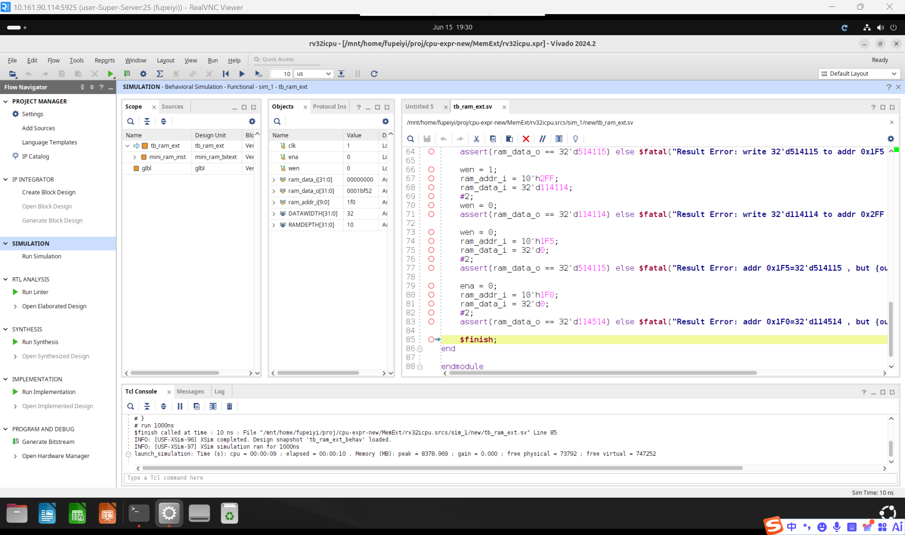
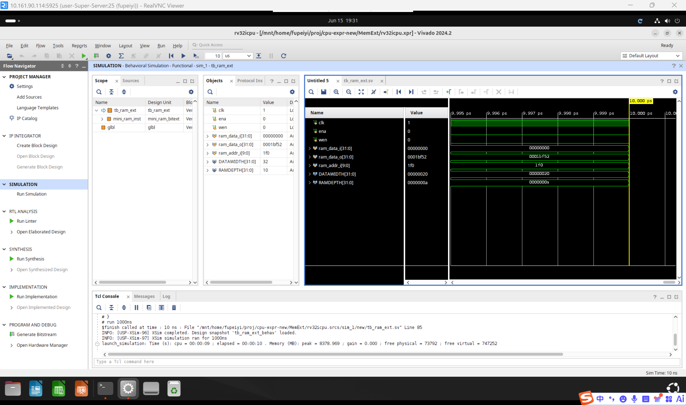

# 一、实验目的

1. 理解存储器扩展的基本原理：字扩展、位扩展和字位扩展
2. 掌握片选信号（CS）在存储器扩展中的使用方法
3. 学习使用层次化设计方法，从基础存储单元逐级构建复杂存储系统
4. 掌握 SystemVerilog 中 `generate` 语句进行模块阵列例化的方法

# 二、实验环境

- 主机操作系统：Windows 11
- 服务器操作系统：Ubuntu 24.04
- 开发工具：Xilinx Vivado 2024.2
- 设计语言：SystemVerilog
- 仿真工具：Vivado Simulator (XSim)
- 目标器件：xc7k325tffg900-2

# 三、实验内容

本实验要求从基础存储单元出发，通过字扩展和位扩展逐级构建一个 1024×32bit 的存储器。具体包括：

1. **mini_ram（基础存储单元）**：实现一个 256×8bit 的基础 RAM 模块，支持时钟上升沿写入和组合逻辑读出。

2. **mini_ram_wortext（字扩展）**：使用 4 片 mini_ram，通过字扩展将地址空间从 256 扩展到 1024（地址线 8→10 位），数据位宽保持 8 位不变。高 2 位地址线用作片选信号。

3. **mini_ram_bitext（位扩展）**：使用 4 片 mini_ram_wortext，通过位扩展将数据位宽从 8 位扩展到 32 位，地址空间保持 1024 不变。4 片并行工作，每片负责 8 位数据。

扩展层次关系：

```
mini_ram (256×8bit) ×4   →   mini_ram_wortext (1024×8bit) ×4   →   mini_ram_bitext (1024×32bit)
       (字扩展，增加地址线)              (位扩展，增加数据线)
```

此外，本实验还需完成 top_ram_ext 顶层模块的例化。

# 四、实验过程

## 4.1 基础存储单元 mini_ram（256×8bit）

### 接口定义

| 信号名 | 方向 | 位宽 | 说明 |
|:-:|:-:|:-:|:-:|
| clk | input | 1 | 系统时钟 |
| wen | input | 1 | 写使能（高有效） |
| ena | input | 1 | 使能信号（高有效），仅控制写入 |
| ram_addr_i | input | 8 | 读/写地址（8位，256深度） |
| ram_data_i | input | 8 | 写入数据 |
| ram_data_o | output | 8 | 读出数据 |

### 实现要点

- **写入为时序逻辑**：`ena=1` 且 `wen=1` 时，在时钟上升沿将 `ram_data_i` 写入 `ram_addr_i` 地址。
- **读出为组合逻辑**：`ram_data_o` 始终等于 `ram[ram_addr_i]`，不受 `ena` 控制（ena 仅门控写入）。这确保了写入后能立即通过读口观察到新值（写优先行为）。

```systemverilog
always_ff @(posedge clk) begin
    if (ena && wen)
        ram[ram_addr_i] <= ram_data_i;
end

assign ram_data_o = ram[ram_addr_i];
```

## 4.2 字扩展模块 mini_ram_wortext（1024×8bit）

### 设计原理

字扩展通过增加地址线来扩大存储容量。4 片 256×8bit 的 mini_ram，通过 2 根额外地址线（ram_addr_i[9:8]）进行片选，将总容量扩展为 4×256=1024 个存储单元。

- 低 8 位地址线（`ram_addr_i[7:0]`）共享连接至所有 4 片 mini_ram。
- 高 2 位地址线（`ram_addr_i[9:8]`）通过 2-4 译码器生成 4 位片选信号 CS[3:0]。
- 同一时刻仅 1 片被选中（`cs[i]=1`），该片的 `ena` 有效，其余片 `ena=0`。
- 输出通过多路选择器从被选中芯片的数据输出中选取。

### 片选译码

| ram_addr_i[9:8] | CS[3:0] | 选中芯片 |
|:-:|:-:|:-:|
| 00 | 0001 | chip 0 |
| 01 | 0010 | chip 1 |
| 10 | 0100 | chip 2 |
| 11 | 1000 | chip 3 |

### 关键实现

```systemverilog
// 2-to-4 译码器
assign cs = (ram_addr_i[9:8] == 2'd0) ? 4'b0001 :
            (ram_addr_i[9:8] == 2'd1) ? 4'b0010 :
            (ram_addr_i[9:8] == 2'd2) ? 4'b0100 :
                                         4'b1000;

// generate 循环例化 4 片 mini_ram
genvar i;
generate
    for (i = 0; i < 4; i++) begin : gen_mini_ram
        mini_ram #(.DATAWIDTH(8), .RAMDEPTH(8))
        mini_ram_inst (
            .clk        (clk),
            .wen        (wen),
            .ena        (ena && cs[i]),    // CS 门控使能
            .ram_addr_i (chip_addr),        // 低 8 位地址
            .ram_data_i (ram_data_i),
            .ram_data_o (chip_data_o[i])
        );
    end
endgenerate
```

## 4.3 位扩展模块 mini_ram_bitext（1024×32bit）

### 设计原理

位扩展通过增加数据线来扩大数据位宽。4 片 1024×8bit 的 mini_ram_wortext 并行工作，每片负责 32 位数据中的 8 位，实现 1024×32bit 的存储能力。

- 所有 4 片共享地址线和控制信号（`ena`、`wen`）。
- 写操作时，32 位输入数据按字节拆分，每片写入对应的 8 位。
- 读操作时，4 片同时输出各自 8 位数据，拼接为 32 位输出。

### 位映射（小端序）

| 芯片 | 数据位范围 |
|:---|:---|
| chip 0 | `ram_data_i[7:0]` |
| chip 1 | `ram_data_i[15:8]` |
| chip 2 | `ram_data_i[23:16]` |
| chip 3 | `ram_data_i[31:24]` |

### 关键实现

```systemverilog
genvar i;
generate
    for (i = 0; i < 4; i++) begin : gen_wortext
        mini_ram_wortext #(.DATAWIDTH(8), .RAMDEPTH(10))
        wortext_inst (
            .clk        (clk),
            .wen        (wen),
            .ena        (ena),
            .ram_addr_i (ram_addr_i),
            .ram_data_i (ram_data_i[i*8 +: 8]),   // 按字节分配
            .ram_data_o (chip_data_o[i])
        );
    end
endgenerate

// 拼接 4 字节为 32 位
assign ram_data_o = {chip_data_o[3], chip_data_o[2],
                     chip_data_o[1], chip_data_o[0]};
```

## 4.4 顶层模块 top_ram_ext

`top_ram_ext` 将 `mini_ram_bitext` 按端口对应关系进行简单例化，作为上板验证的外部接口。

## 4.5 仿真验证

### 测试平台（tb_ram_ext.sv）

测试平台直接测试 `mini_ram_bitext`（最终扩展模块），验证以下功能：

| 测试项 | 操作 | 预期结果 |
|:---|:---|:---|
| 写入并读出 | 写 114514 到地址 0x1F0 | 读出 114514 |
| 跨字边界 | 写 514115 到地址 0x1F5 | 读出 514115 |
| 高位地址 | 写 114114 到地址 0x2FF（高位 CS 选中不同芯片） | 读出 114114 |
| 非覆盖写入 | 读地址 0x1F5（之前写入的值应保留） | 读出 514115 |
| ena 写保护 | ena=0 时尝试写入 0 到地址 0x1F0 | 读出原值 114514 |

### 仿真结果

所有测试均通过，Tcl Console 显示 `$finish` 正常结束，表明：
- 字扩展的片选逻辑正确，不同 CS 区域的数据隔离
- 位扩展的字节拆分/拼接正确
- ena 信号正确门控写入操作





# 五、思考题

**1. 我们实现的 mini_ram_bitext 只能一次性读写 32bit 数据，如果我们要让它可以做到 8bit 读写，需要如何修改 mini_ram_bitext 的结构？**

- 答：需要在位扩展层增加**字节使能信号（byte enable）**。具体做法为添加 4 位 `byte_en` 输入信号，每一位对应一个字节通道。在写操作时，仅 `byte_en[i]=1` 的通道将对应字节写入 RAM；`byte_en[i]=0` 的通道不执行写操作（保持原值）。读操作时，所有字节同时读出（读不需要字节使能），由外部电路选择需要的字节。该设计等价于为每片 mini_ram_wortext 的 `wen` 信号与 `byte_en[i]` 进行与运算。

**2. 你的实现是否支持非字节对齐访问（访问地址 %4 != 0）？由于 RISC-V 的 load 和 store 类型指令并不支持非字节对齐访问，如果要让你的修改对地址进行字节对齐，要怎么做？**

- 答：当前实现**不支持**非字节对齐访问。`ram_addr_i` 同时传递给所有 4 片 mini_ram_wortext，这意味着 4 片的访问地址始终相同，仅支持 32 位对齐的地址（地址低 2 位为 0）。要实现字节对齐（自动将非对齐地址对齐到 4 字节边界），可以在地址输入端增加一个对齐逻辑：`assign aligned_addr = {ram_addr_i[RAMDEPTH-1:2], 2'b00}`，即强制将低 2 位置为 0，使地址总是 4 的倍数。若需处理非对齐情况下的字节偏移，则需结合第 1 问中的字节使能信号，根据 `ram_addr_i[1:0]` 动态调整字节映射。

# 六、实验总结

本实验通过层次化设计方法，从 256×8bit 的基础存储单元出发，依次进行字扩展（容量扩展：256→1024）和位扩展（位宽扩展：8→32），最终构建了一个完整的 1024×32bit 存储器模块。

通过本实验：
- 深入理解了字扩展中片选信号的译码与应用，掌握了地址空间的划分方法
- 掌握了位扩展中数据线的并行拆分与拼接技术
- 学习了使用 `generate` 语句进行模块阵列例化的层次化设计方法
- 认识到存储器的字扩展和位扩展是构建大规模存储系统的基础技术，与计算机体系结构中内存颗粒的组织方式高度一致
