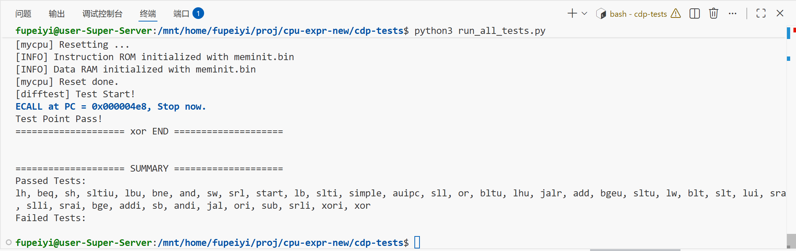

# 一、实验目的

1. 理解从核心指令集 CPU 扩展到完整 MiniRV 指令集的架构变化和设计方法
2. 掌握数据通路表和控制信号表的分析方法，学会系统性地设计 CPU 数据通路
3. 掌握 NPC 模块的 4 种跳转模式设计（顺序/条件分支/jalr/jal）
4. 掌握单级译码 ALU 控制器的设计（opcode+funct → ALUControl）
5. 理解 Load/Store 指令的字节/半字处理机制（扩展与合并）
6. 掌握差分测试（Differential Testing）方法，通过 Trace 测试验证 CPU 正确性

# 二、实验环境

- 主机操作系统：Windows 11
- 服务器操作系统：Ubuntu 24.04
- 开发工具：Xilinx Vivado 2024.2
- 设计语言：SystemVerilog
- 仿真工具：Verilator 5.020 + cdp-tests 差分测试框架
- 目标器件：xc7k325tffg900-2

# 三、实验内容

本实验是前端设计的最后一项实验，将控制器实验中仅支持 7 条指令的核心 CPU 升级为支持 MiniRV 指令集（37 条指令）的完整单周期处理器，并通过 Trace 差分测试验证。

核心任务包括：

1. **NPC 模块重设计**：从原来的 PC+4/PC+imm 二选一，扩展为 4 种 NPC 计算模式（NpcOp 编码 00/01/10/11）
2. **ALU 控制器改版**：从分级译码（Control→ALUOP + ALU_controller→ALUControl）改为单级译码（ACTL 直接根据 opcode+funct 生成 4-bit ALUControl）
3. **主控制器扩展**：新增/修改控制信号——NpcOp[1:0]、MemToReg[1:0]、OffsetOrigin、ALUSrcA
4. **ALU 扩展**：从 4 种运算扩展到 14 种（含移位、比较运算）
5. **IMMGEN 扩展**：从 I/S/B 3 种格式扩展到 I/S/B/U/J 5 种立即数格式
6. **Load/Store 字节半字处理**：实现 lb/lbu/lh/lhu 的提取与扩展、sb/sh 的读-改-写合并
7. **SoC 顶层集成**：例化 myCPU + IROM + DRAM，适配 Trace 测试框架接口

# 四、实验过程

## 4.1 MiniRV 指令集分析

MiniRV 是 RV32I 的一个子集，共 37 条指令，涵盖 6 种指令格式：

| 类别 | 指令 | 数量 | opcode |
|:---|:---|:-:|:---|
| R-type | add, sub, and, or, xor, sll, srl, sra, slt, sltu | 10 | 0110011 |
| I-type ALU | addi, andi, ori, xori, slli, srli, srai, slti, sltiu | 9 | 0010011 |
| Load | lb, lbu, lh, lhu, lw | 5 | 0000011 |
| Store | sb, sh, sw | 3 | 0100011 |
| Branch | beq, bne, blt, bltu, bge, bgeu | 6 | 1100011 |
| U-type | lui, auipc | 2 | 0110111 / 0010111 |
| J-type | jal, jalr | 2 | 1101111 / 1100111 |

## 4.2 架构变更分析

从控制器实验的 7 指令 CPU 升级到 MiniRV CPU，主要架构变更：

### 4.2.1 NPC 重设计

原设计只有 2 种跳转模式（PcSrc = Branch & Zero），新增 jal/jalr 后需要 4 种模式：

| NpcOp | npc 计算 | 对应指令 |
|:-:|:---|:---|
| 00 | pc + 4 | 顺序执行（R/I/S/U 型） |
| 01 | isTrue ? pc+offset : pc+4 | 条件分支（B 型） |
| 10 | offset & ~1 | jalr |
| 11 | pc + offset | jal |

NPC 新增输出 `pcadd4`，用于 jal/jalr 的链接地址写回（rd ← pc+4）。

### 4.2.2 译码方式变更

从分级译码（Control→ALUOP + ALU_controller→ALUControl）变为单级译码（ACTL 直接输出 4-bit ALUControl）。原因是指令类型增多后，分级译码的组合变得复杂，单级译码更直接清晰。

Control 不再输出 ALUOP，ACTL 输入变为 opcode+funct。

### 4.2.3 控制信号变更

| 信号 | 原设计 | 新设计 | 说明 |
|:---|:---|:---|:---|
| NpcOp | Branch (1-bit) | NpcOp (2-bit) | 4 种 NPC 模式 |
| MemToReg | 1-bit | 2-bit | 增加 IMM(lui) 和 PC+4(jal/jalr) 来源 |
| OffsetOrigin | — | 1-bit | NPC offset 来源：0=imm, 1=ALU(jalr) |
| ALUSrcA | — | 1-bit | ALU A 来源：0=rs1, 1=PC(auipc) |

### 4.2.4 ALU 扩展

| ALUControl | 操作 | 对应指令 |
|:-:|:---|:---|
| 0000 | ADD | add, addi, lw/sw/lb/lh, jalr, auipc |
| 0001 | SUB | sub |
| 0010 | AND | and, andi |
| 0011 | OR | or, ori |
| 0100 | XOR | xor, xori |
| 0101 | SLL | sll, slli |
| 0110 | SRL | srl, srli |
| 0111 | SRA | sra, srai |
| 1000 | EQ | beq |
| 1001 | NE | bne |
| 1010 | SLT | blt, slt, slti |
| 1011 | SGE | bge |
| 1100 | SLTU | bltu, sltu, sltiu |
| 1101 | SGEU | bgeu |

每种比较操作同时产生 `Result`（用于 slt/sltu 类指令）和 `isTrue`（用于分支指令）。

## 4.3 模块实现

### 4.3.1 NPC（`NPC.sv`）

```
输入：isTrue, npc_op[1:0], pc[31:0], offset[31:0]
输出：npc[31:0], pcadd4[31:0]

npc_op=00: npc = pc + 4
npc_op=01: npc = isTrue ? (pc + offset) : (pc + 4)
npc_op=10: npc = offset & ~1   // jalr
npc_op=11: npc = pc + offset   // jal
```

### 4.3.2 ACTL（`ACTL.sv`）

```systemverilog
// 单级译码：opcode + funct → ALUControl[3:0]
// opcode 区分指令类型，funct={funct7[5], funct3} 区分子类型
// R-type: funct3 和 funct7[5] 区分 10 种 ALU 操作
// I-type ALU: funct3 区分 9 种立即数 ALU 操作
// B-type: funct3 区分 6 种分支比较
// Load/Store/jalr: 固定 ADD
```

### 4.3.3 Control（`Control.sv`）

控制信号真值表：

| 指令 | opcode | NpcOp | RegWrite | MemToReg | MemWrite | OffsetOrigin | ALUSrc | ALUSrcA |
|:---|:---|:-:|:-:|:-:|:-:|:-:|:-:|:-:|
| R-type | 0110011 | 00 | 1 | 00(ALU) | 0 | 0 | 0 | 0 |
| I-type ALU | 0010011 | 00 | 1 | 00(ALU) | 0 | 0 | 1 | 0 |
| Load | 0000011 | 00 | 1 | 01(DM) | 0 | 0 | 1 | 0 |
| Store | 0100011 | 00 | 0 | XX | 1 | 0 | 1 | 0 |
| Branch | 1100011 | 01 | 0 | XX | 0 | 0 | 0 | 0 |
| LUI | 0110111 | 00 | 1 | 10(IMM) | 0 | 0 | X | 0 |
| AUIPC | 0010111 | 00 | 1 | 00(ALU) | 0 | 0 | 1 | 1 |
| JAL | 1101111 | 11 | 1 | 11(PC+4) | 0 | 0 | X | 0 |
| JALR | 1100111 | 10 | 1 | 11(PC+4) | 0 | 1 | 1 | 0 |

### 4.3.4 IMMGEN（`IMMGEN.sv`）

支持 5 种立即数格式：

| 格式 | 指令 | 立即数生成 |
|:---|:---|:---|
| I-type | load, ALU imm, jalr | `sext(instr[31:20])` |
| S-type | store | `sext({instr[31:25], instr[11:7]})` |
| B-type | branch | `sext({instr[31], instr[7], instr[30:25], instr[11:8], 0})` |
| U-type | lui, auipc | `{instr[31:12], 12'b0}` |
| J-type | jal | `sext({instr[31], instr[19:12], instr[20], instr[30:21], 0})` |

### 4.3.5 Load/Store 字节半字处理

#### Load 扩展（lb, lbu, lh, lhu, lw）

DRAM 读取 32-bit 字后，根据 `funct3` 和地址低 2 位 `addr_low` 提取对应字节/半字并做符号/零扩展：

| 指令 | funct3 | 提取方式 | 扩展方式 |
|:---|:-:|:---|:---|
| lb | 000 | addr_low 选择字节 | 符号扩展至 32-bit |
| lh | 001 | addr_low[1] 选择半字 | 符号扩展至 32-bit |
| lw | 010 | 整字 | 不扩展 |
| lbu | 100 | addr_low 选择字节 | 零扩展至 32-bit |
| lhu | 101 | addr_low[1] 选择半字 | 零扩展至 32-bit |

#### Store 合并（sb, sh, sw）

由于 DRAM 为字级接口（无字节使能），sb/sh 需要读-改-写：

1. 从 DRAM 读取目标地址的完整 32-bit 旧值（组合逻辑读出）
2. 将 rs2 的低字节/半字替换到对应位置
3. 合并后的 32-bit 值写入 DRAM

```systemverilog
// sb 示例 (addr_low=2'b01): 替换 byte 1
store_data = { dram_rdata[31:16], rs2_rdata[7:0], dram_rdata[7:0] };
// sh 示例 (addr_low[1]=1): 替换 halfword 1
store_data = { rs2_rdata[15:0], dram_rdata[15:0] };
```

### 4.3.6 myCPU 顶层集成

myCPU 为不含 IM/DM 的 CPU 核心，例化 12 个子模块 + Load/Store 处理逻辑：

| 模块 | 实例名 | 功能 |
|:---|:---|:---|
| PC | pc_inst | 程序计数器 |
| NPC | npc_inst | 下一条 PC 计算 |
| Control | control_inst | 主控制器（7 个控制信号） |
| ACTL | ACTL_inst | ALU 控制器（单级译码） |
| RF | rf_inst | 寄存器堆（32×32, x0 硬连线 0） |
| IMMGEN | imm_gen_inst | 立即数生成（5 种格式） |
| ALU | alu_inst | 算术逻辑单元（14 种操作） |
| MUX2_1 × 3 | mux_alu_a/b, mux_npc_offset | 2-1 多路选择 |
| MUX4_1 | mux_wb | 写回数据 4-1 选择 |

数据通路关键连线：

```
PC → IROM → instr
instr → Control(opcode), ACTL(opcode+funct), RF(rR1/rR2/waddr), IMMGEN
RF.rR1_data → MUX(ALUSrcA) → ALU.A
RF.rR2_data → MUX(ALUSrc) → ALU.B  (另一路: IMMGEN.imm)
ALU.Result → DRAM.addr, MUX(OffsetOrigin), MUX(MemToReg)
DRAM.rdata → Load扩展 → MUX(MemToReg) → RF.wdata
NPC: pc + isTrue + npc_op + offset → npc, pcadd4
```

Debug 接口采用寄存器化输出，在时钟边沿捕获当前指令的写回结果：

```systemverilog
always_ff @(posedge cpu_clk) begin
    debug_wb_pc    <= pc_out;      // 当前执行指令的 PC
    debug_wb_ena   <= RegWrite;
    debug_wb_reg   <= rd_addr;
    debug_wb_value <= wb_data;
end
```

### 4.3.7 MiniRVCPU SoC 顶层（`miniRV_SoC`）

```systemverilog
module miniRV_SoC (
    input  logic fpga_rst, fpga_clk,
    output logic debug_wb_have_inst, debug_wb_pc,
    output logic debug_wb_ena, debug_wb_reg, debug_wb_value
);
    myCPU Core_cpu (...);
    IROM  Mem_IROM (.a(pc[17:2]), .spo(instr));
    DRAM  Mem_DRAM (.clk, .a(alu[17:2]), .spo, .we, .d);
endmodule
```

IROM/DRAM 使用 Trace 测试框架提供的行为模型（`vsrc/ram.v`），无需 IP 核 xci 文件。

## 4.4 Trace 差分测试

### 测试框架原理

cdp-tests 使用差分测试（Differential Testing）方法：将 golden_model（C 语言实现的 RISC-V 参考模型）与待测 CPU 执行同一条指令，逐周期比对 debug 接口的写回信号。比对项包括：

| 信号 | 说明 |
|:---|:---|
| debug_wb_pc | 写回指令的 PC |
| debug_wb_ena | 寄存器写使能 |
| debug_wb_reg | 写入的目标寄存器号 |
| debug_wb_value | 写入的寄存器值 |

### 测试流程

```
make TEST=<指令名>     # 编译 + 运行单个测试
```

测试用 .bin 文件初始化 IROM/DRAM，测试程序以 `ECALL` 指令结束。测试通过则输出 `Test Point Pass!`。

### 调试中修复的问题

**问题 1：Debug 信号时序**

debug 信号初始为组合逻辑输出。测试框架在时钟下降沿读取 debug 信号，此时 PC 已更新至下一条指令地址，译码结果也变为下一条指令。导致比对时 PC 和寄存器写回值均不匹配。

修复：将 debug 信号改为 `always_ff @(posedge cpu_clk)` 寄存器化，在时钟上升沿捕获当前指令的执行结果。

**问题 2：字节/半字访存指令**

lb/lbu/lh/lhu/sb/sh 6 条指令初始按 32-bit 字处理，导致 Load 读回错误值（未提取/扩展），Store 覆盖了相邻字节（未读-改-写）。

修复：在 myCPU 中添加 Load 扩展逻辑和 Store 合并逻辑，根据 funct3 和地址对齐正确处理字节/半字访问。

### 测试结果

全部 37 个 MiniRV 指令测试通过：

| 类别 | 测试数 | 通过 |
|:---|:-:|:-:|
| R-type | 10 | ✓ |
| I-type ALU | 9 | ✓ |
| Load | 5 | ✓ |
| Store | 3 | ✓ |
| Branch | 6 | ✓ |
| U-type | 2 | ✓ |
| J-type | 2 | ✓ |
| **总计** | **37** | **✓** |



# 五、实验总结

本实验完成了 MiniRV 指令集单周期 CPU 的完整设计，包括：

- **架构升级**：从 7 条指令扩展到 37 条指令，系统性地通过数据通路表和控制信号表分析每条指令在各部件中的连接关系
- **NPC 重设计**：从 2 种跳转模式扩展到 4 种，增加了 jal/jalr 的无条件跳转支持
- **译码方式调整**：从分级译码变为单级译码，ACTL 直接根据 opcode+funct 生成 ALUControl
- **控制信号扩展**：新增 ALUSrcA（auipc）、OffsetOrigin（jalr）、2-bit MemToReg（lui/jal/jalr）
- **ALU 扩展**：从 4 种运算扩展到 14 种（含移位和 6 种比较操作）
- **字节/半字访存**：实现 Load 提取扩展和 Store 读-改-写，正确支持 lb/lbu/lh/lhu/sb/sh
- **差分测试**：通过 cdp-tests 框架的 37 项测试，与 golden_model 逐周期比对完全一致

本次实验是前端设计的综合收官实验，将之前实验实现的所有部件（ALU、PC、RegFile、ImmGen、IM、DM、Controller）在扩展的架构下重新整合，形成了一条支持完整 MiniRV 指令集的单周期 RISC-V 处理器。通过系统性地使用数据通路表和控制信号表进行设计，掌握了 CPU 微架构设计的规范化方法。
