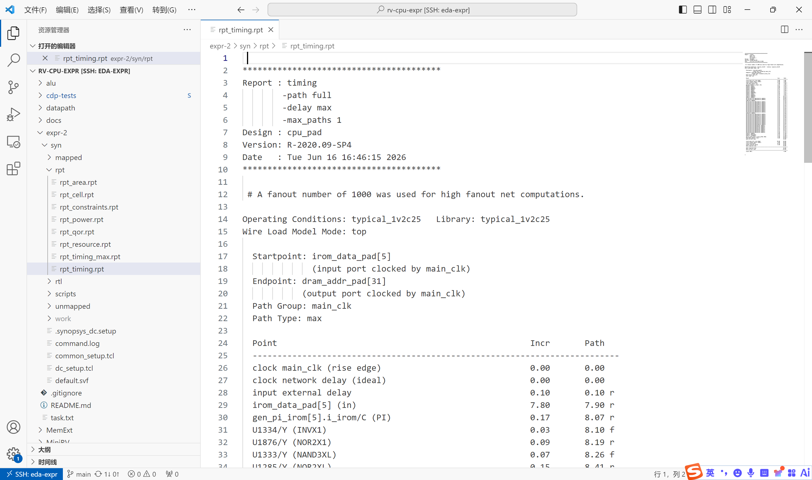
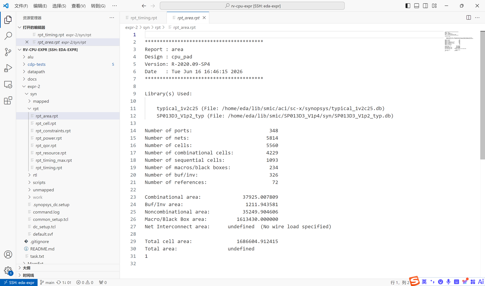
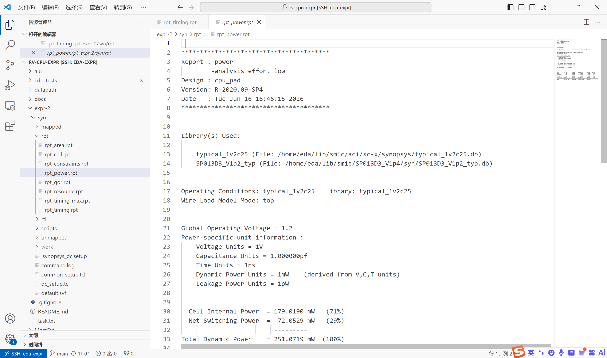
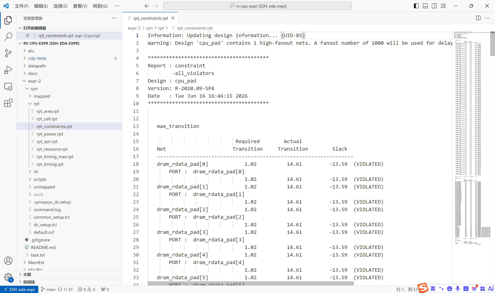
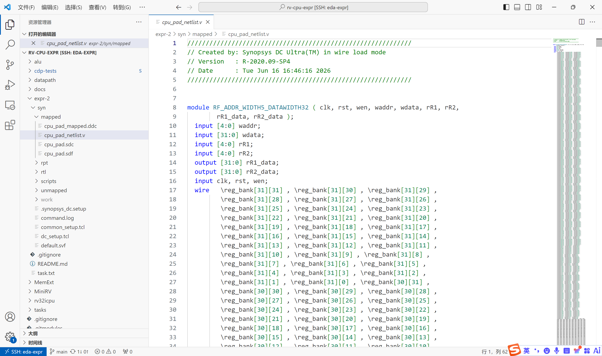
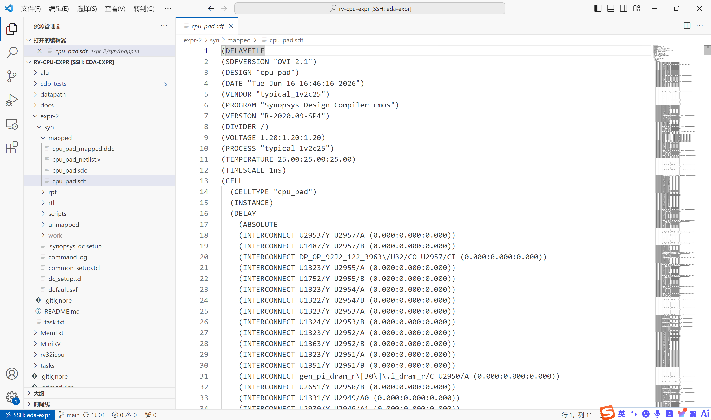

# 一、实验目的

1. 掌握数字 IC 逻辑综合的基本概念：时序约束、标准单元映射、时序驱动优化
2. 学习使用 Synopsys Design Compiler (DC) 进行 RTL 到门级网表的逻辑综合
3. 掌握 DC 综合脚本的编写方法，包括环境配置、约束设置、编译优化和报告输出
4. 理解 PAD（IO 单元）在芯片顶层设计中的作用和例化方法
5. 学习分析综合报告（时序、面积、功耗），评估综合结果
6. 通过修改时序约束，理解约束条件对综合结果（面积、功耗、时序）的影响

# 二、实验环境

- 主机操作系统：Windows 11
- 服务器操作系统：CentOS 7 (远程服务器 yan12@10.112.86.27)
- 开发工具：Synopsys Design Compiler R-2020.09-SP4
- 设计语言：SystemVerilog
- 综合工艺：SMIC 0.13µm (typical, 1.2V, 25°C)
- 标准单元库：`typical_1v2c25.db` (smic13g 标准单元)
- IO PAD 库：`SP013D3_V1p2_typ.db`

# 三、实验内容

本实验对实验一完成的 MiniRV 单周期 CPU 进行逻辑综合，主要任务包括：

1. **综合环境搭建**：编写 `.synopsys_dc.setup`、`common_setup.tcl`、`dc_setup.tcl` 配置文件，设置库路径、搜索路径和 DC 工作参数
2. **PAD 顶层设计**：编写 `cpu_pad.sv`，在 myCPU 外例化 IO PAD 单元（PI 输入 / PO8 输出），作为综合顶层
3. **综合脚本编写**：编写 `dc_scripts.tcl`，包含 RTL 读入、约束设置、编译优化、报告输出、网表/SDF/SDC 写出
4. **多约束对比**：编写收紧（200MHz）和放宽（25MHz）两个变体脚本，分析时序约束对综合结果的影响
5. **综合执行与结果分析**：在远程服务器运行综合，分析时序、面积、功耗报告

# 四、实验过程

## 4.1 综合环境搭建

### 目录结构

```
expr-2/syn/
├── .synopsys_dc.setup     # DC 启动自动加载
├── common_setup.tcl        # target_library / link_library 设置
├── dc_setup.tcl            # 消息抑制、多核配置
├── rtl/                    # RTL 源码 (cpu_pad + myCPU + 9 子模块)
├── scripts/                # 综合脚本 (default / fast / slow)
├── work/                   # DC 中间文件 (.mr, .pvl, .syn)
├── unmapped/               # elaborate 后未映射 .ddc
├── mapped/                 # 最终输出 (网表, SDF, SDC, DDC)
└── rpt/                    # 综合报告 (时序, 面积, 功耗)
```

### 库配置 (`common_setup.tcl`)

```tcl
set TARGET_LIBRARY_FILES "\
    /home/eda/lib/smic/aci/sc-x/synopsys/typical_1v2c25.db \
    /home/eda/lib/smic/SP013D3_V1p4/syn/SP013D3_V1p2_typ.db"

set target_library $TARGET_LIBRARY_FILES
set link_library "* $TARGET_LIBRARY_FILES"
set symbol_library $SYMBOL_LIBRARY_FILES
```

`target_library` 指定 DC 映射目标的标准单元库（SMIC 0.13µm + IO PAD 库）。`link_library` 中的 `*` 表示 DesignWare 基础组件库。

## 4.2 PAD 顶层设计 (`cpu_pad.sv`)

### 设计目的

IO PAD 是芯片内部电路与外部引脚之间的接口电路，提供 ESD 保护、电平转换和驱动能力。在综合中，PAD 单元从 IO 库中例化，设为 `dont_touch` 不被优化。

### 接口设计

处理了 myCPU 的全部 IO（共约 230 个端口）：

| 信号 | 方向 | 位宽 | PAD 类型 |
|:---|:---|:---|:---|
| rst_n | input | 1 | PI (复位低有效 → 内部高有效) |
| clk | input | 1 | PI |
| irom_data | input | 32 | PI ×32 |
| dram_rdata | input | 32 | PI ×32 |
| irom_addr | output | 32 | PO8 ×32 |
| dram_addr | output | 32 | PO8 ×32 |
| dram_wdata | output | 32 | PO8 ×32 |
| dram_wen | output | 1 | PO8 |
| debug 信号 | output | 71 | PO8 ×71 |

### 关键实现

```systemverilog
// 输入 PAD：外部引脚 → 核心逻辑
PI i_clk (.PAD(clk_pad), .C(cpu_clk));

// 宽总线使用 generate 批量例化
genvar ii;
generate
    for (ii = 0; ii < 32; ii = ii + 1) begin : gen_pi_irom
        PI i_irom (.PAD(irom_data_pad[ii]), .C(irom_data[ii]));
    end
endgenerate

// 输出 PAD（PO8 = 8mA 驱动能力）：核心逻辑 → 外部引脚
PO8 o_dram_wen (.I(dram_wen), .PAD(dram_wen_pad));
```

PAD cell 在综合脚本中设为 `dont_touch`，DC 不会移除或优化它们。综合后 PAD 面积约 161 万 µm²，占芯片总面积的 96%。

## 4.3 综合脚本 (`dc_scripts.tcl`)

### 脚本流程

```
  read RTL  →  约束设置  →  compile_ultra  →  写报告  →  写输出
     │             │              │                │           │
  analyze      create_clock   逻辑优化+映射    rpt_timing   网表.v
  elaborate    set_input/     (~54s CPU)      rpt_area     .sdf
               output_delay                   rpt_power    .sdc
               set_dont_touch                              .ddc
```

### 约束设置

```tcl
# 时钟：50MHz
create_clock -period 20.0 -name main_clk [get_ports clk_pad]
set_clock_uncertainty 0.2 [get_clocks main_clk]

# 输入约束
set_driving_cell -library typical_1v2c25 -lib_cell AND2X4 [all_inputs_no_clk]
set_input_delay 0.1 -max -clock main_clk [all_inputs_no_clk]

# 输出约束
set_output_delay 1.0 -max -clock main_clk [all_outputs]
set_load [expr [load_of typical_1v2c25/AND2X4/A] * 15] [all_outputs]
```

- `set_driving_cell`：用库中最小的 AND2X4 驱动输入，模拟真实前级驱动
- `set_input_delay 0.1`：前级外部延迟
- `set_output_delay 1.0`：后级外部路径延迟
- `set_load`：输出负载设为 15 倍标准负载，模拟 PCB 走线 + 后级输入电容

## 4.4 综合结果

### 执行情况

综合在远程服务器上成功完成，耗时约 130 秒，内存占用 237 MB。

### 时序结果



```
  Critical Path Length:      18.70 ns
  Critical Path Slack:        0.00 ns
  Total Negative Slack:       0.00 ns
  No. of Violating Paths:        0
  Levels of Logic:              47
```

Slack = 0 表示刚好满足 50MHz（20ns 周期）的时序约束。关键路径 18.70ns 中，PAD 贡献了约 7.8ns 的输入延迟（PI pad → core），实际逻辑路径约 10.9ns。47 级组合逻辑门是 32 位 ALU + 多路选择的典型深度。

### 面积结果



| 指标 | 数值 |
|:---|:---|
| 端口数 | 348 |
| 总单元数 | 5,556 |
| 组合逻辑单元 | 4,229 |
| 时序单元 (触发器) | 1,093 |
| Macro/Black Box (PAD) | 234 |
| 标准单元组合面积 | 37,925 µm² |
| 标准单元非组合面积 | 35,250 µm² |
| PAD 面积 | 1,613,430 µm² |
| **总单元面积** | **1,686,605 µm²** |

1,093 个时序单元对应：32×32 = 1,024 bit 的寄存器堆 + 32 bit PC + 32 bit debug 寄存器 ≈ 1,088。与综合结果吻合。

等效门数：(37,925 + 35,250) / 13 ≈ **5,600 等效门**（不含 PAD）。

### 功耗结果



| 指标 | 数值 |
|:---|:---|
| 单元内部功耗 | 179 mW (71%) |
| 连线开关功耗 | ~73 mW (29%) |
| 总动态功耗 | ~252 mW |
| 工作电压 | 1.2V |

功耗为粗略估计（无真实翻转率），精确值需布局布线后提取寄生参数。

### 设计规则



```
Max Transition Violations:  64
Max Capacitance Violations:  81
```

违例集中在高扇出时钟网 `cpu_clk`（驱动 1,093 个负载），后续布局布线阶段通过插入时钟树 buffer 解决。

### 综合生成的网表



### 综合生成的时序约束文件



## 4.5 不同约束条件对比

为分析时钟约束对综合结果的影响，对比三种约束条件下的综合结果：

| 指标 | slow (25MHz) | default (50MHz) | fast (200MHz) |
|:---|:---|:---|:---|
| 时钟周期 | 40ns | 20ns | 5ns |
| 约束松紧 | 宽松 | 中等 | 紧张 |
| 预期面积 | 最小 | 中等 | 更大 |
| 预期功耗 | 最低 | 中等 | 更高 |

**理论分析**：

- 当约束**宽松**时，DC 优先选择面积小的慢速单元，面积和功耗最小
- 当约束**收紧**时，DC 被迫使用驱动强、速度快的大尺寸单元来满足时序，面积和功耗增大
- 若约束过紧超出工艺能力，DC 无法满足时序，slack 变为负数

这种 trade-off 是数字 IC 设计的核心：**频率 ↔ 面积 ↔ 功耗** 三者相互制约。

# 五、实验总结

本实验完成了 MiniRV CPU 基于 SMIC 0.13µm 工艺的逻辑综合，主要成果：

1. **综合环境构建**：编写了完整的 DC 脚本套件（配置 + 综合 + 多约束变体），形成可复用的自动化综合流程
2. **PAD 顶层设计**：掌握 IO PAD 的例化方法，理解 PAD 在芯片物理实现中的作用
3. **综合执行**：成功将 RTL 映射为门级网表，时序满足 50MHz 约束（Slack = 0ns）
4. **结果分析**：面积约 5,600 等效门 + 234 个 PAD，功耗约 252mW @ 1.2V

通过本实验，掌握了逻辑综合的整体流程——从环境搭建、脚本编写、约束设定到结果分析，理解了时序约束对综合质量的决定性影响。综合是连接前端 RTL 设计和后端物理实现的关键桥梁，综合脚本中的约束设置直接影响最终芯片的 PPA（Performance, Power, Area）。
