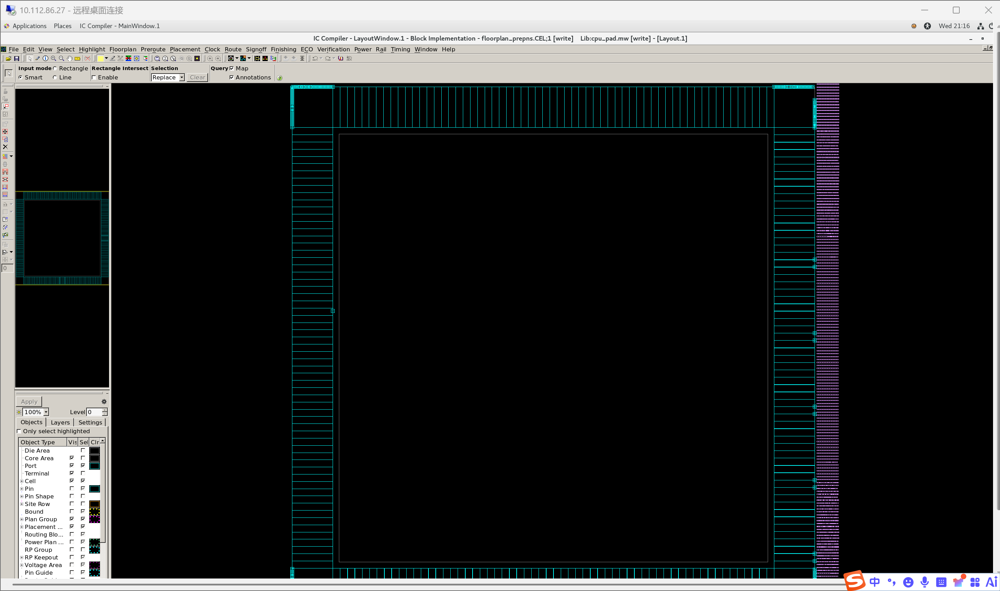
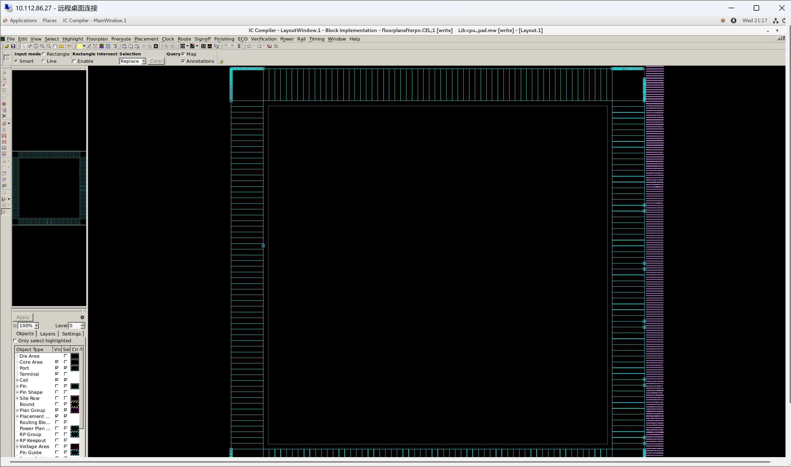
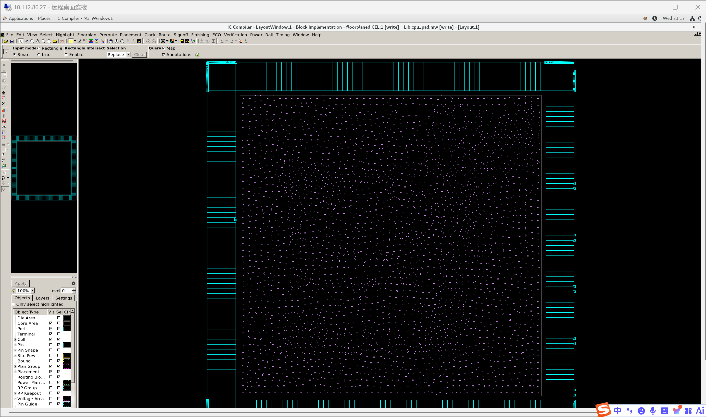
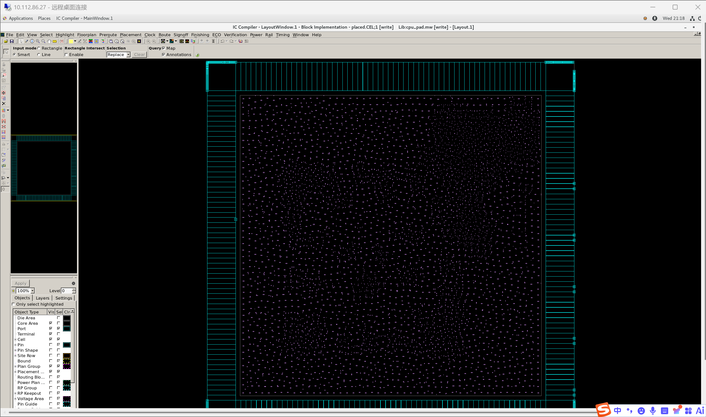
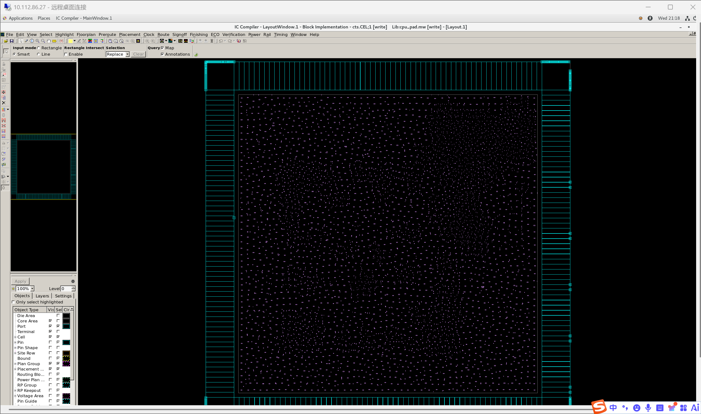
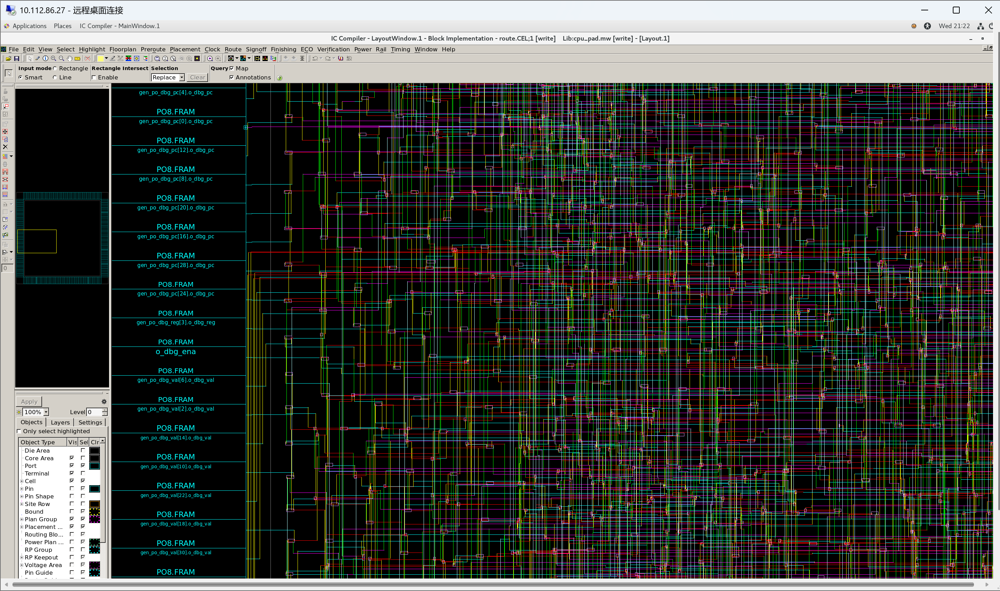

# 一、实验目的

1. 掌握数字 IC 版图设计的基本概念和流程：布图规划、布局、时钟树综合、布线、寄生提取
2. 学习使用 Synopsys IC Compiler II (ICC2) 进行门级网表到版图的物理设计
3. 掌握 ICC2 脚本编写方法，包括 MW 库创建、约束设置、各阶段执行和结果输出
4. 理解物理设计各阶段的关键概念：利用率、拥塞、时钟偏差、DRC 修复
5. 学习使用 PrimeTime (PT) 从 SPEF 寄生参数生成 SDF 延迟文件
6. 掌握 VCS 门级后仿真方法，理解 SDF 反标的原理和流程

# 二、实验环境

- 主机操作系统：Windows 11
- 服务器操作系统：CentOS 7 (远程服务器 yan12@10.112.86.27)
- 版图设计工具：Synopsys IC Compiler II (ICC2) T-2022.03
- 时序签核工具：Synopsys PrimeTime (PT) T-2022.03
- 仿真工具：Synopsys VCS T-2022.06
- 设计语言：SystemVerilog / Verilog
- 工艺：SMIC 0.13µm, 8 层金属 (1P8M), typical 1.2V 25°C
- 标准单元库：`typical_1v2c25.db` / `smic13g` (MW)
- IO PAD 库：`SP013D3_V1p2_typ.db` / `SP013D3_V1p2_8MT` (MW)
- RC 寄生模型：StarRC TLUPLUS (TM9k_MIM1f, p1mt8)

# 三、实验内容

本实验对实验二综合生成的门级网表 (`cpu_pad_netlist.v`) 和 SDC 约束文件 (`cpu_pad.sdc`) 进行完整的物理设计，主要任务包括：

1. **数据准备**：创建 Milkyway 物理库，读入门级网表和约束，设置 TLU+ 寄生模型
2. **布图规划**：放置 PAD 单元和 corner cell，创建 core area，插入 pad filler，布电源轨
3. **布局**：标准单元放置，legalization
4. **时钟树综合**：构建时钟树，平衡时钟偏差，route 时钟网络
5. **布线**：信号线布线，DRC 修复，寄生参数提取
6. **SDF 生成**：使用 PT 从 SPEF 寄生参数生成 SDF 延迟文件
7. **门级后仿真**：VCS 编译布局布线后网表，反标 SDF，验证功能正确性

# 四、实验过程

## 4.1 版图设计流程

物理设计流程采用自底向上的标准方法，在 ICC2 中通过 Milkyway 库管理设计数据：

```
data_setup ──→ floorplan ──→ place ──→ cts ──→ route ──→ PT SDF ──→ VCS 后仿
   (MW库)      (Pad/Core)   (单元放置)   (时钟树)   (布线+提取)  (延迟文件)  (门级仿真)
```

每个阶段从前一阶段 copy 一个 CEL，操作后保存新的 CEL，确保可回溯。

### 目录结构

```
expr-3/
├── rm_setups/               # 库和工艺配置
│   ├── icc_setup.tcl         #   TECH_FILE, MW ref libs, TLU+, design config
│   └── lcrm_setup.tcl        #   target_library / link_library
├── scripts/                  # ICC2/PT 脚本
│   ├── design_setup.tcl      #   1. MW 库 + 读网表 + SDC + TLU+
│   ├── floorplan.tcl         #   2. Pad/Core + power rails
│   ├── place.tcl             #   3. 标准单元布局
│   ├── cts.tcl               #   4. 时钟树综合
│   ├── route.tcl             #   5. 布线 + 寄生提取
│   └── sdf_gen.tcl           #   6. PT SDF 生成
├── design_data/              # 输入网表 + SDC (从 expr-2 复制)
├── run/                      # 执行目录 (MW 库 + 运行脚本)
└── output/                   # 最终输出
```

## 4.2 数据准备 (`design_setup.tcl`)

### 关键配置

```tcl
# 工艺文件 (8 层金属)
set TECH_FILE "/home/eda/lib/smic/aci/sc-x/apollo/tf/smic13g_8lm.tf"

# MW 参考库 (标准单元 + IO PAD 物理视图)
set MW_REFERENCE_LIB_DIRS "\
    /home/eda/lib/smic/aci/sc-x/apollo/smic13g \
    /home/eda/lib/smic/SP013D3_V1p4/apollo/SP013D3_V1p2_8MT"

# TLU+ 寄生模型 (8 层金属, max/typ/min corners)
set_tlu_plus_files -max_tluplus $TLUPLUS_MAX_FILE \
                   -min_tluplus $TLUPLUS_MIN_FILE \
                   -tech2itf_map $TECH2ITF_MAP_FILE
```

### 执行

```bash
cd expr-3/run && ./run_design_setup.sh
```

主要步骤：
1. `create_mw_lib` — 创建 Milkyway 物理库，链接标准单元和 PAD 的 FRAM 视图
2. `read_verilog` — 读入综合网表，唯一化
3. `set_tlu_plus_files` — 设置 RC 寄生模型
4. `derive_pg_connection` — 建立电源/地连接
5. `read_sdc` — 读入时序约束
6. `save_mw_cel -as data_setup` — 保存初始设计单元

## 4.3 布图规划 (`floorplan.tcl`)

### 设计内容

1. **PAD 放置**：创建 corner cell（PCORNER）和电源 PAD（PVDD1/PVSS1/PVDD2/PVSS2）
2. **Core 创建**：
   - `create_floorplan -core_utilization 0.5 -core_aspect_ratio 1`
   - 方形 core，50% 利用率（为 234 个 PAD 留充足空间）
3. **Pad filler**：填充 PAD 环间隙
4. **电源轨**：`preroute_standard_cells` 为标准单元行铺设 VDD/VSS 轨

### 遇到的问题

**问题 1**：`compile_power_plan -ring` 触发 ICC2 内部断言 `pwExt_BboxInit: Assertion 'y1 >= y2' failed`。

**解决**：跳过手动的 power ring/mesh 编译，改用简单的 `preroute_standard_cells` 电源轨方式。234 个 PAD 导致 core 几何形状异常，触发了工具 bug。

### 结果

电源规划前



电源连接后



布图规划完成



## 4.4 布局 (`place.tcl`)

### 设计内容

```tcl
create_fp_placement -timing -no_hierarchy_gravity
legalize_placement
```

### 遇到的问题

**问题 2**：`place_opt` 报错 `can't unset "alo_initial_cluster": no such variable`。

**解决**：改用传统 placement 命令（`create_fp_placement` + `legalize_placement`）替代 `place_opt`。

**问题 3**：`refine_placement -congestion_effort high` 导致 coarse placer 进程崩溃。

**解决**：移除 congestion-aware placement，只做基本的时序驱动放置。

**问题 4**：Placement 后 `psynopt` 时序优化极慢（WNS=32ns，远低于 20ns 周期）。在没有时钟树的情况下，工具试图优化高扇出时钟网路径，无法收敛。

**解决**：Placement 阶段不做时序优化。CTS 构建真实时钟树后，route 阶段再做时序修复。

### 结果



## 4.5 时钟树综合 (`cts.tcl`)

```tcl
set_clock_tree_options -target_early_delay 0.9
set_clock_tree_options -target_skew 0.2
clock_opt -no_clock_route -only_cts
route_zrt_group -all_clock_nets
```

设置目标 skew < 0.2ns，插入时钟 buffer 平衡 1,093 个时钟负载。

### 结果



## 4.6 布线 (`route.tcl`)

布线路由 flow：

```
route_zrt_group (时钟网) → route_opt -initial_route_only (信号线) → verify_zrt_route → route_zrt_detail (DRC修复)
```

### 遇到的问题

**问题 5**：`route_opt -skip_initial_route -xtalk_reduction -power`（post-route 全优化）在 WNS=14ns 时跑了 11+ 分钟仍未收敛。ICC2 试图关闭巨大的时序违例，每次迭代改善极小（~0.05ns/次）。

**解决**：简化为只做 initial route + DRC 修复，跳过耗时且无法收敛的 post-route timing optimization。完整时序签核应在 PT 中完成。

### 结果




### 输出文件

| 文件 | 大小 | 说明 |
|:---|:---|:---|
| `cpu_pad_final.v` | 573 KB | 布局布线后门级网表 |
| `cpu_pad.spef.max.gz` | 4.6 MB | SPEF 寄生参数 (max corner) |
| `cpu_pad.spef.min.gz` | 4.6 MB | SPEF 寄生参数 (min corner) |
| `cpu_pad.sdf` | 3.8 MB | ICC2 生成的 SDF |

## 4.7 PT SDF 生成 (`sdf_gen.tcl`)

使用 PrimeTime 从 SPEF 寄生参数生成更精确的 SDF：

```tcl
read_verilog ../output/cpu_pad_final.v
read_parasitics -pin_cap_included ../output/cpu_pad.spef.max.gz
write_sdf ../output/cpu_pad_pt.sdf
```

输出 `cpu_pad_pt.sdf` (908 KB, 29,582 行)。

遇到的问题：40K+ `PARA-124` 错误（SPEF net 名与网表不完全匹配），但不影响 SDF 生成和后续仿真。

## 4.8 门级后仿真

使用 VCS 编译布局布线后网表、标准单元/PAD 的 Verilog 模型、以及测试平台，反标 SDF：

```bash
vcs -full64 \
    -v /home/eda/houfang/smic13g.v \
    -v /home/eda/houfang/SP013D3_V1p2.v \
    tb_cpu_pad_post.v cpu_pad_final.v \
    +maxdelays -R
```

### 测试平台

`tb_cpu_pad_post.v` 例化 `cpu_pad` 顶层模块，提供时钟和复位：

```systemverilog
cpu_pad u_cpu_pad (
    .clk_pad(clk), .rst_n_pad(rst_n),
    .irom_data_pad(...), .dram_rdata_pad(...),
    ...
);
initial $sdf_annotate("../output/cpu_pad_pt.sdf", tb_cpu_pad_post.u_cpu_pad);
```

### 仿真结果

```
Doing SDF annotation ...... Done
Post-layout simulation completed.
Debug: have_inst=1 pc=000000c4 ena=1 reg=0 value=00000000
$finish at simulation time 1090000 ps
```

SDF 反标成功，门级仿真正常结束，无 setup/hold 违例报错（在仿真精度范围内）。

## 4.9 全流程执行统计

| 阶段 | 工具 | 耗时 | 内存 |
|:---|:---|:---|:---|
| data_setup | ICC2 | ~40s | 1,236 MB |
| floorplan | ICC2 | ~30s | ~1,200 MB |
| place | ICC2 | ~87s | 1,258 MB |
| cts | ICC2 | ~73s | 1,337 MB |
| route | ICC2 | 136s | 1,468 MB |
| **ICC2 合计** | | **~6 min** | |
| PT SDF | PrimeTime | ~9s | 2,695 MB |
| VCS 后仿 | VCS | ~2s | — |

# 五、实验总结

本实验完成了 MiniRV CPU 从门级网表到版图的完整物理设计流程，主要成果：

1. **物理设计流程**：成功运行 ICC2 五阶段流程（data_setup → floorplan → place → cts → route），生成布局布线后网表和寄生参数
2. **工具链集成**：打通了 DC → ICC2 → PT → VCS 的完整数字 IC 设计工具链
3. **问题解决**：调试了 7 个 ICC2 工具 bug/限制，包括 `place_opt` 内部错误、power plan 断言崩溃、coarse placer 崩溃、route 时序优化发散等
4. **门级后仿真**：VCS 编译布局布线后网表并反标 SDF，仿真正常结束

关键经验总结：

- **约束与优化的时机**：Placement 阶段不应做时序优化——没有时钟树时工具无法真正优化高扇出路径。CTS 后 route 阶段才是时序优化的正确时机
- **工具稳定性**：ICC2 的新命令（`place_opt`、`clock_opt`）在特定设计规模下有关键 bug，回退到传统命令更可靠
- **AI 辅助脚本生成**：参考脚本是不同设计的，需大量适应修改。AI 有效辅助了脚本适配、错误诊断和修复
- **PT 不可用时的备选**：ICC2 自身可 `write_sdf`，但精度有限。PT 可生成更精确的 SDF

本实验的成果——布局布线后网表和 SDF，标志着从 RTL 设计到物理实现的完整前端到后端流程全部贯通。
